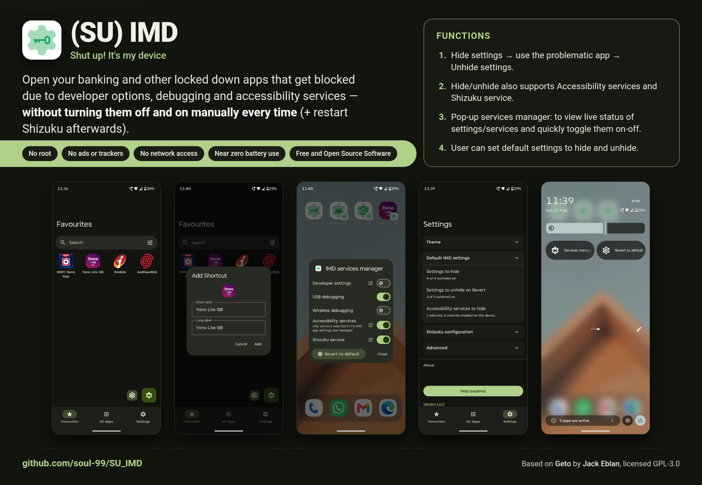

# (SU) IMD

**(SU) IMD — Shut up! it's my device**

## Description

Open banking and other locked-down apps without turning developer options, USB debugging, wireless debugging or your accessibility services off by hand every single time.

Some apps refuse to run — or quietly disable parts of themselves — when they detect developer options, an ADB connection or an active accessibility service. The usual workaround is to go and switch those things off before opening the app and switch them back on afterwards, every time. IMD does that for you: pick an app, say which settings should change while it runs, and launch it from here. The settings are applied, the app opens, and an ongoing notification with a **Revert** action puts your device back the way it was.

It is a fork of [Geto](https://github.com/JackEblan/Geto), rebuilt around the parts that did not survive real use — Shizuku dying with USB debugging, accessibility services that were listed but never actually stopped, and a quick re-enable settings button in app.

- **Package:** `com.soul_99.suIMD` — installs alongside stock Geto, both can coexist
- **Requires:** Android 7.0 (API 24) or newer, and `WRITE_SECURE_SETTINGS` granted once over ADB or Shizuku. **No root.**
- **Licence:** GPL-3.0
- **No** ads, analytics, trackers, accounts or network access of any kind. The app never talks to the internet.

Grant the permission once with a PC:

```
adb shell pm grant com.soul_99.suIMD android.permission.WRITE_SECURE_SETTINGS
```

or, with no PC, tap **Use Shizuku** on the first-run screen and it runs that command for you. The screen also shows the command with a copy button and re-checks itself when you come back, so you never have to type it twice. The grant survives reboots but not a reinstall.

<p>
  
</p>

## Functions

### From the original Geto

- Per-app profiles of Android **system**, **secure** and **global** settings.
- A searchable, sortable list of every installed apps.
- A browsable copy of the device's current settings
- Launch app from inside IMD or shortcut with its profile applied, and an ongoing notification carrying the **Revert** action.
- A settings-observer foreground service.

### Added in this fork

#### v1.5

Everything since v1.1, the last version published here.

* **New ‘IMD services manager’ Dialog box**: A new dialog box to view the live status of each setting and services (including Shizuku service), and also allows to toggle them on/off easily.
* **New ‘Revert to default’ mechanism** (previous revert mechanism is now called ‘memory function’ mechanism): this new mechanism allows to revert all the settings at once to a universal default state which is configured by the user in settings.
* Both ‘Revert to default function’ and ‘IMD services manager’ gets:
  * **Quick setting tiles** (with short and long press actions).
  * **Homescreen shortcuts**: long press on the IMD icon to create those shortcuts.
  * **Favourites tab buttons**
* User can choose either old or new mechanism for notifications.
* **New detailed Readme in app**: to help user on how to setup the app.
* **Obtainium**: In app link to add app to obtainium.
* **New settings page options and redesign**
* Material design update
* Newer icons

#### v1.1

- Better Shizuku integeration with auto-fill for default values.
- Support for Shevery and other Shizuku forks which support start service intents for automation (original RikkaApps fork doesn't support start intents).

#### v1.0

- Shizuku service restart
- Working accessibility services flag, with per service enable/disable
- Proper previous setting state read with **setting memory**
- Favourites tab
- Re-enable settings/services button in favourites tab
- Matching shortcut icons to android adaptive icon
- A new better initialisation screen with Shizuku support to grant permissions
- Material Design search box

## Source

This app is a fork of **[Geto](https://github.com/JackEblan/Geto)** by **Jack Eblan**, licensed GPL-3.0. All of the original design and the great majority of the code are his; the additions above are the difference. Full credit for the app this is built on goes to him.

- **Original project:** https://github.com/JackEblan/Geto
- **This fork:** by soul_99 (Dr. Utkarsh Rajput)
- **Licence:** [GNU General Public License v3.0](LICENSE) — the same licence as the original, as required.

`SUIMD.md` documents what was changed and why, including the bugs found in the original and the reasoning behind each fix.

## The future of this fork

I'm a radiology resident doctor, not a software developer. Writing software is a hobby, and this app
exists because I wanted it to exist for myself — so please don't expect future builds,
regular updates, or fixes for problems on devices I don't own. If it works for you, good; if
it breaks, I may well not be able to help.

The source is all here under the GPL-3.0. Use it freely for your own purposes — build it,
change it, fork it, keep the changes to yourself or pass them on. That is what it is for.

Thanks!

---

*Long live free and open source software!*
