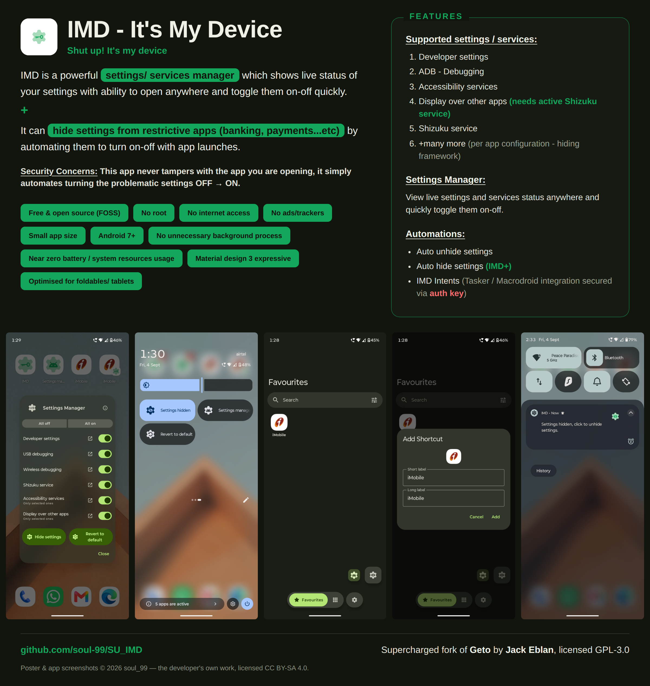
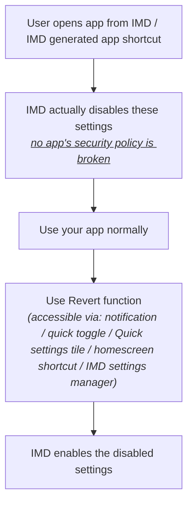
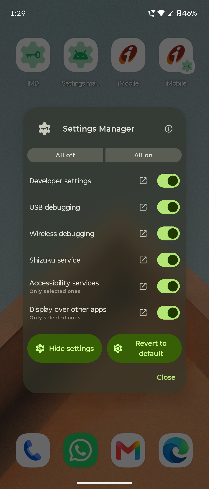
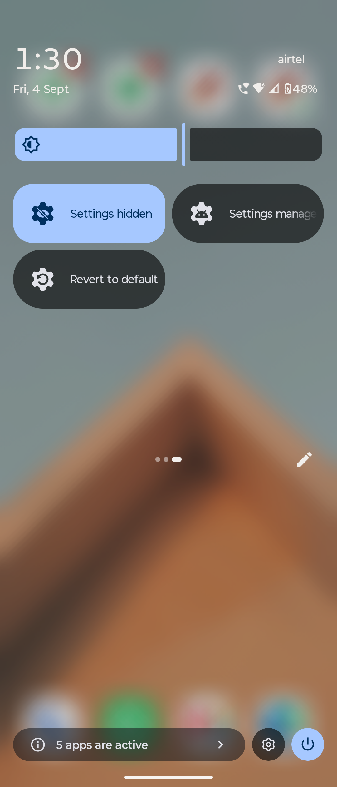
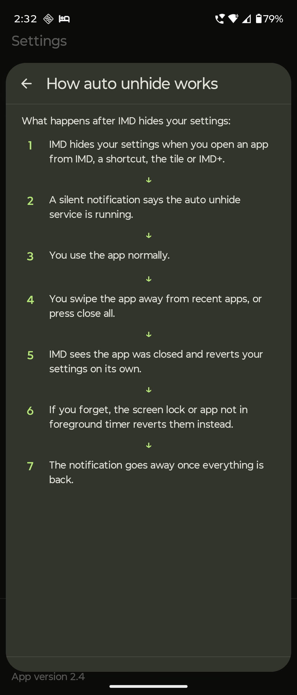
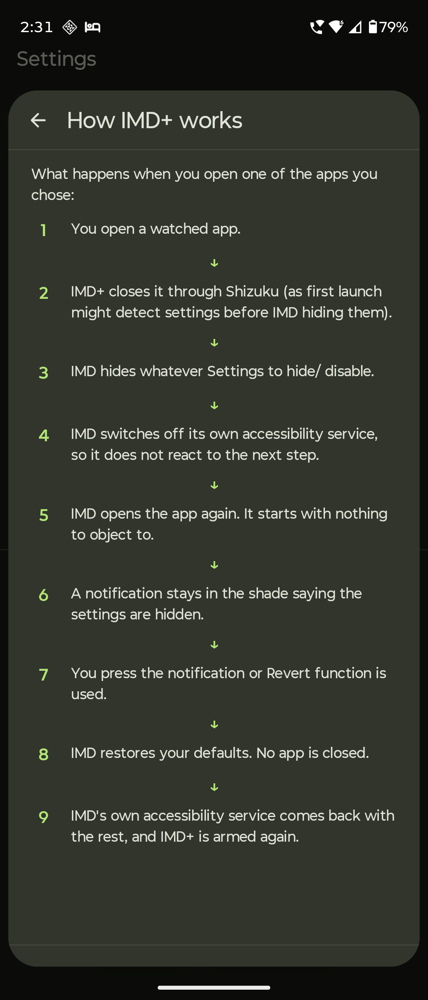
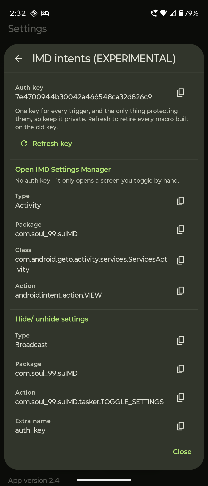

# IMD - It's My Device

Supercharged fork of [Geto](https://github.com/JackEblan/Geto)

  

IMD (It's My Device) is a ***<mark>powerful settings/ services manager</mark>*** and ***<mark>settings/ services hider</mark>*** (automated disable-enable settings) for restrictive apps (banking, payments...etc). It supports the following settings / services :

1. Developer settings
2. ADB / Debugging
3. Accessibility services
4. Display over other apps (needs active Shizuku service)
5. Shizuku service
6. and many more (per app configuration - hiding framework, hint: use Settings observer for help)

#### How this works flowchart

## Settings manager

  
  

IMD's settings manager allows you to:

1. View the ***live status*** of your settings/ services
2. Quickly toggle them on-off

## Automations

  
  
  

1. **Auto unhide settings**
2. **Auto hide settings** (IMD+ : needs background service)
3. **IMD Intents** (Tasker / MacroDroid integration, secured with auth keys)

## About Permissions

* `WRITE_SECURE_SETTINGS` (one time grant via adb shell or Shizuku) (MANDATORY, needed to change settings state)
* Shizuku service (optional) (needed to hide Display over other apps permissions - an appops permission)
* Post notifications (optional)
* Other permissions (optional: only needed if you use automations like IMD+)

## Security Concerns

* No internet access or unnecessary continuous background services (so almost zero battery / system resource use).
* Does not tamper with any apps on the device.
* The parts of this app that change settings cannot be triggered by another app, so only you can change them.
* No ads, analytics, trackers or accounts of any kind. The app has no network permission at all - which is also why it cannot check for its own updates, and why Obtainium is how you find out there is one.

- **Package:** `com.soul_99.suIMD` - installs alongside stock Geto, both can coexist
- **Requires:** Android 7.0 (API 24) or newer. **No root.**
- **Licence:** GPL-3.0

## Changelog

Every release and what changed in it: **[CHANGELOG.md](CHANGELOG.md)**

## Support the project 🫶 (for free)

I created this app in my busy schedule of full-time medical residency.

Initially it was born out of my personal needs, but after positive community feedback, I decided to share it with the FOSS community.

I want it to be taken over by more capable developers in future, as my profession does not allow me to maintain it all year round.

**<u>You can do these for free, if you want to support this project and keep it alive.</u>**

1. **Share this project/app to community. This is most helpful and will help to keep the project alive.**
   (I don't need any credit or mentions) [Share the repo »](https://github.com/soul-99/SU_IMD)
2. ⭐ Star [the GitHub repo](https://github.com/soul-99/SU_IMD) to increase its visibility.
3. [Report](https://github.com/soul-99/SU_IMD/issues/) bugs in the main repo.
4. [Join](https://www.reddit.com/r/SU_IMD/) discussions.
5. Contribute to the code or docs, if you are a developer.

  <b>- soul_99</b> 
  (Dr. Utkarsh Rajput)

## Development & Contributions

- **Created by:** [soul_99](https://github.com/soul-99/) (Dr. Utkarsh Rajput)
- **Contributions:** [RafayGhafoor](https://github.com/RafayGhafoor) (Display over other apps initial framework)
- **Original Project:** [Geto](https://github.com/JackEblan/Geto) by [JackEblan](https://github.com/JackEblan)
- **License:** IMD is licensed under the GNU General Public License v3.0, same as the original. See the [license](https://github.com/JackEblan/Geto/blob/master/LICENSE) for more information.

Before you change anything, read **[SUIMD.md](SUIMD.md)** first. It documents how the app works, how each of its logics runs, and what was changed from the original Geto and why - including the bugs found in it and the reasoning behind each fix. Almost everything that looks odd in this code is answered there.

Then read **[CONTRIBUTING.md](CONTRIBUTING.md)** before you open a pull request.

## About this project

I'm a full time radiology resident doctor, software is just a part time hobby.

This app exists because I wanted it to exist for myself, I have made multiple revisions after testing every build, fixing bugs and adding features, making the app what it is now - **on par with my expectations.**

Please know that due to my profession, it might take me some time for me to reply to queries, fix bugs and add new features in future builds, so please be patient.

But I do plan to maintain this app for the near future, until someone else makes a better app for the same purpose.

&nbsp;

Namaste 🙏 & Thanks !

---

*Long live free and open source software!*
