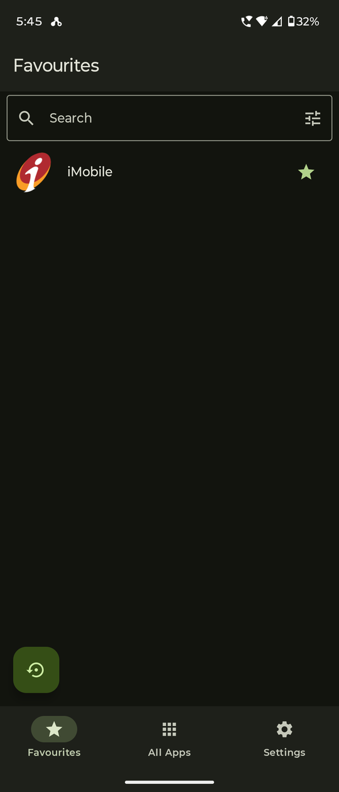
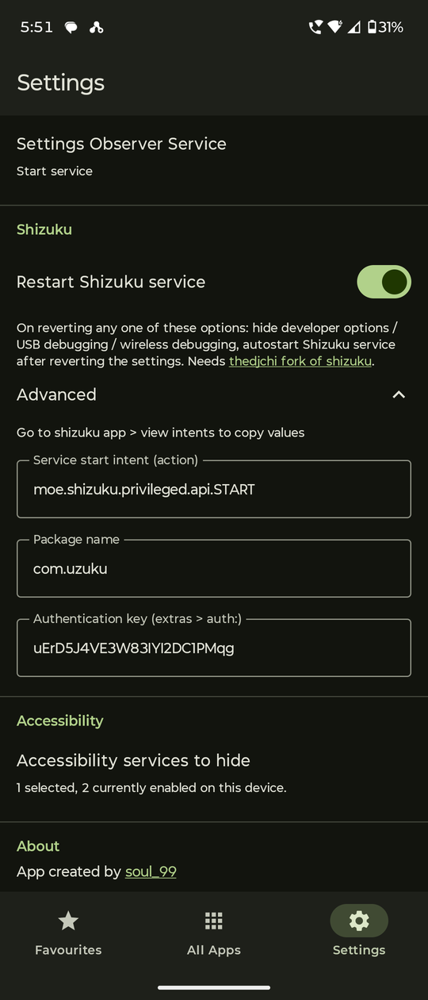
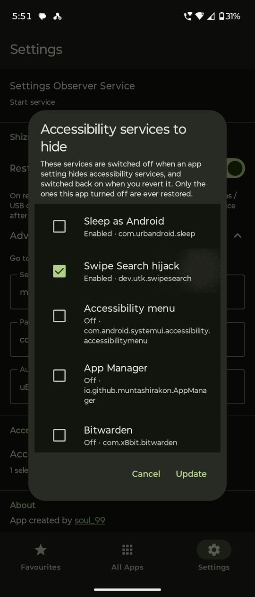
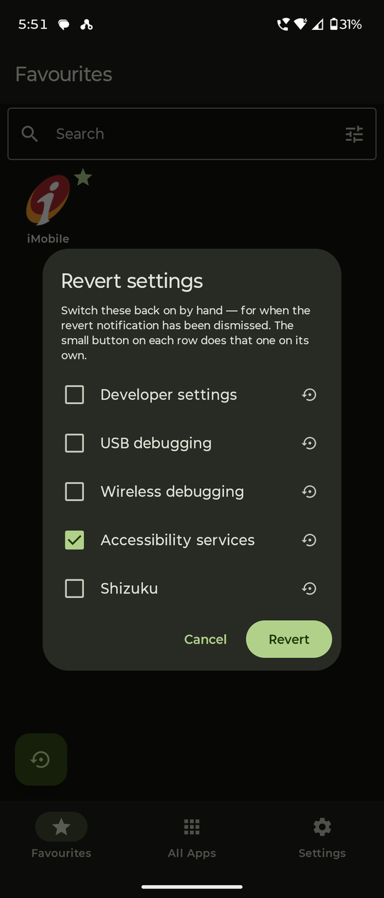

# IMD

**SU IMD — Shut up! it's my device**

## Description

Open banking and other locked-down apps without turning developer options, USB debugging, wireless debugging or your accessibility services off by hand every single time.

Some apps refuse to run — or quietly disable parts of themselves — when they detect developer options, an ADB connection or an active accessibility service. The usual workaround is to go and switch those things off before opening the app and switch them back on afterwards, every time. IMD does that for you: pick an app, say which settings should change while it runs, and launch it from here. The settings are applied, the app opens, and an ongoing notification with a **Revert** action puts your device back the way it was.

It is a fork of [Geto](https://github.com/JackEblan/Geto), rebuilt around the parts that did not survive real use — Shizuku dying with USB debugging, accessibility services that were listed but never actually stopped, and a quick re-enable settings button in app.

- **Package:** `com.soul_99.suIMD` — installs alongside stock Geto, both can coexist
- **Requires:** Android 7.0 (API 24) or newer, and `WRITE_SECURE_SETTINGS` granted once over ADB or Shizuku. **No root.**
- **Licence:** GPL-3.0
- **No** ads, analytics, trackers, accounts or network access of any kind. The app never talks to the internet.

Grant the permission once with a PC:

```
adb shell pm grant com.soul_99.suIMD android.permission.WRITE_SECURE_SETTINGS
```

or, with no PC, tap **Use Shizuku** on the first-run screen and it runs that command for you. The screen also shows the command with a copy button and re-checks itself when you come back, so you never have to type it twice. The grant survives reboots but not a reinstall.

## Screenshots

<!-- Header row omitted on purpose: every shot carries its own title bar. GitHub needs
     the separator row for a table to render at all, so it stays but is left empty. -->
|  |  |  |  |
| --- | --- | --- | --- |
|  |  |  |  |

## Functions

### From the original Geto

- Per-app profiles of Android **system**, **secure** and **global** settings, each with a value to apply on launch and a value to restore on exit.
- A searchable, sortable list of every installed app (by name, install time or update time; ascending or descending; system apps optionally shown).
- A browsable copy of the device's current settings, so a key can be found and copied rather than remembered.
- Launch an app from inside IMD with its profile applied, and an ongoing notification carrying the **Revert** action.
- **Pinned home-screen shortcuts** per app: tapping one applies the profile and opens the app without going through IMD at all.
- Material 3 interface with a light/dark/follow-system theme and Android 12+ dynamic colour.
- A settings-observer foreground service.

### Added in this fork

- **Shizuku service restart.** Hiding developer options, USB debugging or wireless debugging takes the Shizuku service down with them, and turning them back on does not bring it back. Reverting any of those now fires Shizuku's start intent, after a short pause for adbd to restart and re-advertise. Configured in Settings → Shizuku by copying the action, package name and authentication key from Shizuku's own *View intents* screen — which means a stealth-renamed install needs no special handling. Requires [thedjchi's Shizuku fork](https://github.com/thedjchi/Shizuku/releases), the only build that listens for a start intent.
- **Accessibility services that actually stop.** Upstream wrote a single flag, in the wrong settings table, which does not stop a running service. IMD lists every installed accessibility service, lets you pick exactly which ones it may switch off, and rewrites the real enabled-services list. Reverting restores precisely the ones it removed — never a service you switched on yourself in the meantime, and never one another app still has held down.
- **Shortcut icons that match the real app icon.** Pinned shortcuts now hand the launcher a full-bleed adaptive bitmap, so it applies its own mask and inset exactly as it does for the app itself, instead of a pre-masked picture that ends up the wrong shape and size next to its neighbours.
- **Favourites tab.** Star an app from the list or from its own settings screen. Favourites can be sorted custom (with a reorder dialog) or alphabetically, shown as a list or a grid, and set so a tap launches and a long press edits — or the other way round. A tap here applies the app's profile first, exactly like a pinned shortcut.
- **Re-enable settings/services, from the Favourites tab.** A button in the bottom-right corner opens *Re-enable settings/services*: tick developer settings, USB debugging, wireless debugging, accessibility services and Shizuku, and switch them all back on at once. This is the way out when the revert notification has been swiped away — once developer options are off, there is no system screen left to switch them back on from. Accessibility services are switched on whatever state they were last in, because the usual reason for opening this is that the record of what was switched off is gone. Each row also has its own small button that does just that one thing, and the ticked set is remembered between openings.
- **A first-run screen that cannot be skipped** until `WRITE_SECURE_SETTINGS` and notifications are actually granted, checked against live system state rather than a "seen it" flag — so a reinstall that loses the ADB grant is caught instead of leaving the app looking functional while every write silently fails. The permission can be granted from the phone itself with one tap through Shizuku, or with the ADB command if a computer is to hand; the Shizuku route goes through the binder rather than the package name, so a renamed or hidden Shizuku works too.
- **A rebuilt launcher icon**, generated as vector geometry from the source artwork and shipped as a proper adaptive icon with a themed-icon monochrome layer, sized to sit alongside upstream Geto rather than tower over it.
- **Previous setting state memory.** Upstream reverts each setting to the *Value on revert* you typed when you wrote the profile — a guess made in advance, not a fact about the device. So a profile that hides developer options would switch them **on** when reverted, even for someone who had them off all along, and with developer options being what they are there is then no screen left to undo it from. IMD records what every setting was really set to in the moment before the profile is applied, and reverting puts those values back. The configured revert value is still used as a fallback for profiles applied before this existed. The *Re-enable settings/services* button is deliberately exempt: that one is an explicit "switch these on", so it ignores the record entirely.
- **A Material search field**, and a Favourites tab that opens instantly — it resolves just the apps you starred instead of enumerating and rendering every launcher entry on the device first.

## Source

This app is a fork of **[Geto](https://github.com/JackEblan/Geto)** by **Jack Eblan** (Einstein Blanco), licensed GPL-3.0. All of the original design and the great majority of the code are his; the additions above are the difference. Full credit for the app this is built on goes to him.

- **Original project:** https://github.com/JackEblan/Geto
- **This fork:** maintained by soul_99 (Dr. Utkarsh Rajput)
- **Licence:** [GNU General Public License v3.0](LICENSE) — the same licence as the original, as required.

`SUIMD.md` documents what was changed and why, including the bugs found in the original and the reasoning behind each fix.

---

*Long live free and open source software!*
