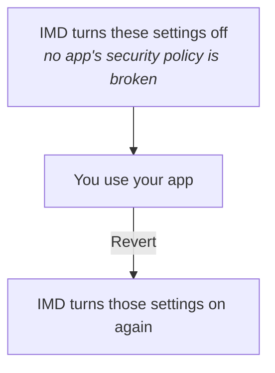
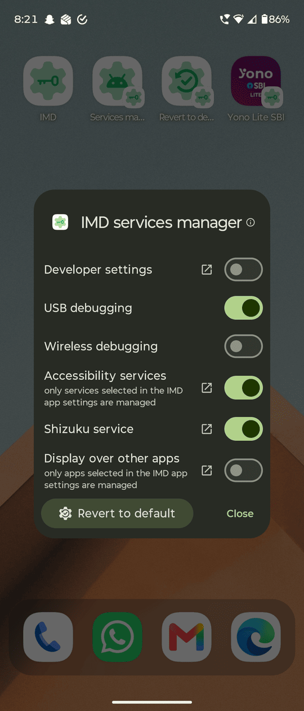

# (SU) IMD - Shut up! it's my device

## Description

<p>
  
</p>

Open banking and other restricted apps without turning on/ off these settings manually everytime:

1. Developer settings
2. Debugging
3. Accessibility services
4. Display over other apps (needs active Shizuku service)
5. Shizuku service
6. and many more (you need to manually configure them using Memory function of app, hint: use Settings observer to help yourself)

#### How this works



Some apps refuse to run or quietly disable parts of themselves when they detect these settings or services. The usual workaround is to go and switch those things off before opening the app and switch them back on afterwards, every time.
IMD does that for you: pick an app, say which settings should change while it runs, and launch it from here. The settings are applied, the app opens, and an ongoing notification with a **Revert** action puts your device back the way it was.

#### IMD services manager

<p>
  
</p>

The other half of that: one dialog showing the live state of Developer settings, USB debugging, Wireless debugging, your managed Accessibility services, the Shizuku service and Display over other apps, with a switch on each and a **Revert to default** button at the bottom.
It opens from a Quick Settings tile, a homescreen shortcut or the Favourites tab — without the app itself having to be open — which is what you reach for when a banking app has just refused to start and you do not want to go hunting through Android's settings to find out why.

#### Tasker / MacroDroid integration (EXPERIMENTAL, secured with auth keys)

Drive IMD from an automation app with an auth key that is random per install and refreshable: open the IMD services manager, Revert to default, Revert using memory, or hide your configured settings and services - all working even when IMD is not running. Set it up under Advanced settings, where every value has a copy button. Off by default, and every trigger is refused until you turn it on.

It is a fork of [Geto](https://github.com/JackEblan/Geto), rebuilt around the parts that did not survive real use - Shizuku dying with USB debugging disable, accessibility services that actually never stopped, and a quick re-enable settings button in app.

- **Package:** `com.soul_99.suIMD` - installs alongside stock Geto, both can coexist
- **Requires:** Android 7.0 (API 24) or newer, and `WRITE_SECURE_SETTINGS` granted once over ADB or Shizuku. **No root.**
- **Licence:** GPL-3.0
- **No** ads, analytics, trackers, accounts or network access of any kind. The app never talks to the internet.

## About Permissions

* `WRITE_SECURE_SETTINGS` (one time grant via adb shell or Shizuku) (MANDATORY, needed to change settings state)
* Shizuku service (optional) (needed to hide Display over other apps permissions - an appops permission)
* Post notifications (optional)

## Security Concerns

* No internet access or unnecessary continuous background services (so almost zero battery / system resource use).
* Does not tamper with any apps on the device.
* The parts of this app that change settings cannot be triggered by another app, so only you can change them.

## Install

Grab the APK from the [releases page](https://github.com/soul-99/SU_IMD/releases), or let [Obtainium](https://github.com/ImranR98/Obtainium) watch that page and update the app for you:

<a href="https://apps.obtainium.imranr.dev/redirect.html?r=obtainium%3A%2F%2Fadd%2Fhttps%3A%2F%2Fgithub.com%2Fsoul-99%2FSU_IMD">
  
</a>

The app itself has no network permission, so it cannot check for its own updates — Obtainium is how you find out there is one.

Grant the permission once with a PC:

```
adb shell pm grant com.soul_99.suIMD android.permission.WRITE_SECURE_SETTINGS
```

or, with no PC, tap **Use Shizuku** on the first-run screen and it runs that command for you. The screen also shows the command with a copy button and re-checks itself when you come back, so you never have to type it twice. The grant survives reboots but not a reinstall.


## Functions

### Added in this fork

#### v2.0

**New**

- **Hide "Display over other apps"** - for banking apps that refuse to run while another app can draw over them. Needs Shizuku, only the apps you pick are touched, and Revert gives the permission back. _(contribution by [RafayGhafoor](https://github.com/RafayGhafoor))_
- **Auto Revert on returning** (off by default) - puts your settings back automatically when you return to IMD after launching an app from it.
- **Tasker / MacroDroid integration** (Experimental) - drive IMD from an automation app (open the services manager, Revert to default, Revert using memory, or hide your settings) with a per-install auth key. Off by default, and works even when IMD is not running.
- **Settings observer log** - the observer now records which settings an app changed, with View log / Clear log in Settings.
- **Manage 'Display over other apps'** switch in Advanced - hides every overlay control on a device that has no Shizuku.
- **Support the project 🫶 (for free)** button in About - a short note and free ways to help.

**Improved**

- A revert always restores everything it can, and a notification reports anything it could not.
- If "Display over other apps" cannot be hidden on launch, nothing else is changed - the app simply does not open.
- Only the apps and services you selected are ever touched.
- Fixed Shizuku start/stop when the fork's app is closed but its service runs, and re-enabling accessibility services from the manager.
- The notification's **Revert** button now clears it and closes the shade the instant it is pressed; the Shizuku spinner also shows for shortcut launches.
- The IMD services manager shortcut can be created by any launcher again.

_Under the hood: revert/hide ordering around Shizuku corrected and device state re-read after each start, the start-Shizuku signal resent across its 10-second wait, per-app overlay controls hidden while the feature is off, the About screen re-laid-out, and translations plus the initialisation screen updated._

#### v1.6.8

1. updated shortcuts creation configuration so that third party apps cannot use them
2. Updated shizuku configuration dialog

#### v1.6.7

* added all languages for testing
* The notification's revert button now names the mechanism it will run: **Revert to default** or **Revert using memory**.
* The **UI** settings section is now called **User interface**.
* Wording fix in the **Revert to default configuration** dialog.

#### v1.6.6

* The default **Settings to unhide on revert** are changed due to security reasons.
* Documentation update.

#### v1.6.5

1. added other languages support (in testing)
   1. Portuguese (Brazilian)
   2. Spanish
   3. Simplified Chinese
   4. French
   5. German
   6. Russian
   7. Hindi
   8. Arabic
   9. Korean
   10. Japanese

#### v1.6

* Default configuration options for both **Settings to hide** & **Settings to unhide**.
* short press opens app, Long press creates shortcut.
* **IMD services manager**: shows the IMD app icon, and long pressing ‘Revert to default’ opens its configuration. The Accessibility services toggle greys out when no services are selected in IMD settings.
* **Settings reorganised**: ‘App functions’ is now ‘Default IMD settings’, opens expanded, and holds ‘Settings to hide’ and ‘Settings to unhide on Revert’. Notification function moved to Advanced.
* **Shortcut labels autofilled** with the app’s own name.
* Notifications now say **IMD** and **Settings hidden/disabled**.

#### v1.5
(Multiple builds and versions were made between v1.5 and v1.1, this is a combined list of all changes) 

* **New ‘IMD services manager’ Dialog box**: A new dialog box to view the live status of each setting and services (including Shizuku service), and also allows to toggle them on/off easily.
* **New ‘Revert to default’ mechanism** (previous revert mechanism is now called ‘memory function’ mechanism): this new mechanism allows to revert all the settings at once to a universal default state which is configured by the user in settings.
* Both ‘Revert to default function’ and ‘IMD services manager’ gets:
  * **Quick setting tiles** (with short and long press actions).
  * **Homescreen shortcuts**: long press on the IMD icon to create those shortcuts.
  * **Favourites tab buttons**
* User can choose either old or new mechanism for notifications.
* **New detailed Readme in app**: to help user on how to setup the app.
* **Obtainium**: In app link to add app to obtainium.
* **New settings page options and redesign**
* Material design update
* Newer icons

#### v1.1

- Better Shizuku integeration with auto-fill for default values.
- Support for Shevery and other Shizuku forks which support start service intents for automation (original RikkaApps fork doesn't support start intents).

#### v1.0

- Shizuku service restart
- Working accessibility services flag, with per service enable/disable
- Proper previous setting state read with **setting memory**
- Favourites tab
- Re-enable settings/services button in favourites tab
- Matching shortcut icons to android adaptive icon
- A new better initialisation screen with Shizuku support to grant permissions
- Material Design search box

### From the original Geto

- Per-app profiles of Android **system**, **secure** and **global** settings (if using memory function as notification function).
- A searchable, sortable list of every installed apps.
- A browsable copy of the device settings.
- Launch app from inside IMD or shortcut with its profile applied, and an ongoing notification carrying the **Revert** action.
- A settings-observer foreground service.

## Support the project 🫶 (for free)

I created this app in my busy schedule of full-time medical residency.

Initially it was born out of my personal needs, but after positive community feedback, I decided to share it with the FOSS community.

**You can do these for free, if you want to support my work and keep this project alive**

I want it to be taken over by a more capable developer in future, as my profession does not allow me to maintain it all year round.

1. Spread the word if you can - it helps the community, and I don't need any credit or mention. [Share the repo »](https://github.com/soul-99/SU_IMD)
2. ⭐ Star the [GitHub repo](https://github.com/soul-99/SU_IMD) to increase its visibility.
3. [Report bugs](https://github.com/soul-99/SU_IMD/issues) in the main repo.
4. Join discussions.
5. Contribute to the code or docs, if you are a developer.

## Development & Contributions

- **Created by:** [soul_99](https://github.com/soul-99/) (Dr. Utkarsh Rajput)
- **Contributions:** [RafayGhafoor](https://github.com/RafayGhafoor) (Muhammad Rafay Awan)
- **Original Project:** [Geto](https://github.com/JackEblan/Geto) by [JackEblan](https://github.com/JackEblan)
- **License:** (SU) IMD is licensed under the GNU General Public License v3.0, same as the original. See the [license](https://github.com/JackEblan/Geto/blob/master/LICENSE) for more information.

View [SUIMD.md](https://github.com/soul-99/SU_IMD/blob/main/SUIMD.md), which documents how to use the app, and what was changed and why with each version - including the bugs found in the original and the reasoning behind each fix.

This app is a fork of **[Geto](https://github.com/JackEblan/Geto)** by **Jack Eblan**, licensed GPL-3.0. All of the original design and the great majority of the code are his; the additions above are the difference. Full credit for the app this is built on goes to him.

## The future of this fork

I'm a full time radiology resident doctor, software is just a part time hobby. This app
exists because I wanted it to exist for myself, I have made multiple revisions after testing every build, fixing bugs and adding features, making the app what it is now - **on par with my expectations**. Please know that it will take some time for me to reply to queries, fix bugs and add new features in future builds, so please be patient. 
But I do plan to maintain this app for the near future, until someone else makes a better app for the same purpose.

The source is all here under the GPL-3.0. Use it freely for your own purposes - build it,
change it, fork it, keep the changes to yourself or pass them on. That is what it is for.

Thanks!

---

*Long live free and open source software!*
