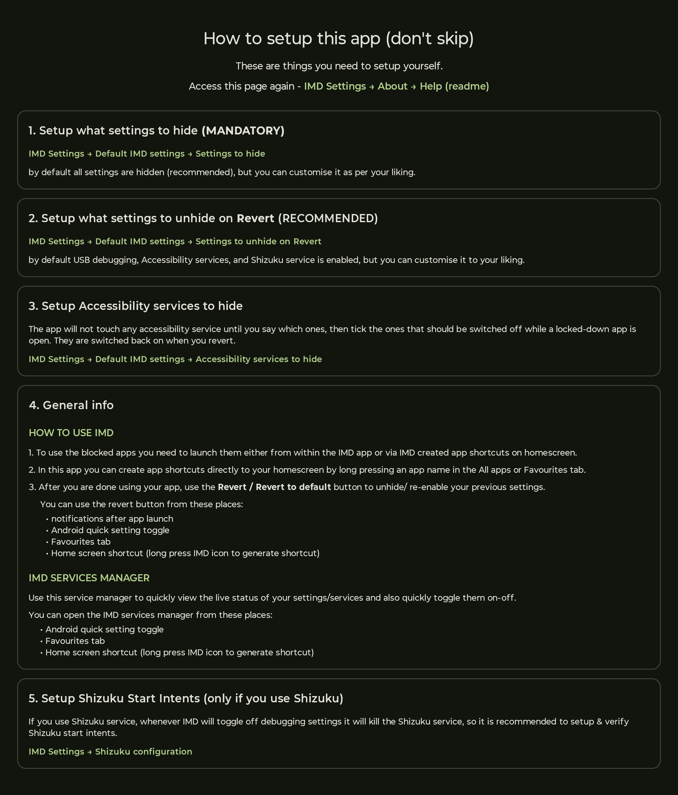

# SUIMD.md

**(SU) IMD - Shut up! it's my device** is a fork of [Geto](https://github.com/JackEblan/Geto)
by Jack Eblan, licensed GPL-3.0.

Three parts:

1. **Setup guide** - the app's own help page.
2. **Version history** - what changed in each build, what worked, what broke.
3. **Licence and attribution** - the notices this fork is required to carry.

---

## 1. Setup guide

  

---

## 2. Version history

Every version below was built by soul_99 in Android Studio, signed with his own keys, and
installed and used on his own phone before release. Anything under **Broke** was found that
way unless it says otherwise - this list is what testing turned up, not a list of things
that shipped broken.

Newest first.

### v1.6.1 - 23 August 2026 · versionCode 9

**Changed**

- The **Settings to hide** dialog now warns, in red, that it applies to every app, and
  points anyone wanting per-app settings to the memory function under
  *Advanced → Notification function*.
- Store metadata added to the repository (description, icon, screenshots, per-version
  changelogs) in the layout F-Droid and Obtainium read.
- README rewritten; the poster rebuilt on v1.6 screenshots.

### v1.6 - 23 August 2026 · versionCode 8

The release that made the app usable without configuring anything first.

**Changed**

- **Settings to hide** - one device-wide answer to "what gets switched off when an app
  launches", so an app that has never been configured can still be opened. Four targets,
  all on by default.
- **Settings reorganised.** "App functions" became **Default IMD settings**, opens
  expanded, and holds *Settings to hide*, *Settings to unhide on Revert* and *Accessibility
  services to hide*. Notification function moved to Advanced, as did the Shizuku restart
  switch.
- **Tap launches, long press makes a shortcut** - in All apps as well as Favourites. Under
  the memory function a long press still opens that app's own profile, because there is one
  to edit.
- **Services manager** shows the app's icon, so a dialog appearing over someone else's app
  says who put it there. Long-pressing *Revert to default* opens its configuration, from the
  tile and the shortcut too. The Accessibility row greys out when no services have been
  picked, and says why when tapped.
- **Shortcut labels autofilled** with the app's own name.
- **Notifications** all read *IMD* / *Settings hidden/disabled*, instead of three different
  wordings depending on where the launch came from.
- **Help page rewritten** and shown full screen, reachable afterwards from
  *Settings → About → Help (readme)*.
- **Notifications are needed to finish setup, not to keep using the app.** Turning them off
  later costs the Revert button on the notification; the tile, the shortcut and the in-app
  button still work. `WRITE_SECURE_SETTINGS` stays mandatory.
- **RevertActivity is no longer exported**, so no other installed app can trigger a revert.
- **Re-organise favourites** gained a remove button beside the arrows.
- Every install upgrading into v1.6 is moved to *Revert to default* once, because the
  memory function plus a device-wide configuration is the one combination that looks broken.
- The large top app bar stopped shifting the page on every change of scroll direction.

**Broke, then fixed**

- The create-shortcut dialog autofilled the **previous** app's name. Its ViewModel belongs
  to the tab, not the dialog, so the second time it opened, the old icon and lookup were
  still there. The icon and the lookup now travel with the component name they belong to,
  and nothing is drawn until they match.
- Long-pressing *Revert to default* worked **once per launch of the app**. The request was a
  boolean set true on the first press and never reset. It is a counter now.
- A source package left out a file that had been changed and then changed back, so the build
  failed on `SettingsNavigation.kt`. A packaging mistake, not an app bug.

**Confirmed working on device**

Pinned shortcut from the Quick Settings tile; notifications; the v1.6 upgrade migration;
long-press Revert in the services manager, with the right label; scrolling.

### v1.5 - 22-23 August 2026

**Changed**

- **Revert to default** - a second way back. Where the existing revert undoes what one app
  changed, this drives the device to a state you nominate once, which is the answer to "I no
  longer know what is switched off" after a notification has been swiped away.
- Five things trigger it - notification, Quick Settings tile, launcher shortcut, Favourites
  button, in-app button - and all five go through one runner.
- The notification became a **choice**: the memory function (per app, as before) or Revert
  to default.
- Settings became collapsible sections plus About; the Shizuku panel became *Configuration*
  and now states which forks it can drive at all.
- The setup help page was rewritten, and a **Help (readme)** button in About shows the same
  page rather than a second copy that could drift.
- An **Add to Obtainium** link in About.
- A revoked `WRITE_SECURE_SETTINGS` grant now surfaces instead of failing silently - the
  first refused write reopens setup.

**Broke, then fixed**

- **Shizuku was reported as started the moment the broadcast was sent.** Starting Shizuku is
  a broadcast, not a call, so a switch could read on for a service that never came up, and a
  revert could fail with nothing anywhere saying so. All three paths now poll for up to ten
  seconds, and the outcome is stored so a failure from a tile - where nothing is on screen -
  survives until the manager is next opened.
- **Shizuku autostart fired after reverts that never touched USB debugging**, at a service
  that had never stopped.
- **The revert configuration forced Shizuku and USB debugging to move together.** The rule
  assumed the service always runs over USB, which depends on how Shizuku was started; it was
  overriding deliberate choices to enforce a constraint that was not real. Every target is
  independent now.
- **Opening the manager from the tile dragged the whole app forward** behind the dialog,
  over whatever was actually on screen.
- **Tapping a favourite with nothing configured launched it silently**, which is how someone
  comes to believe a profile is being applied when none exists. It now says so.

### v1.4 - 22 August 2026

**Changed**

- The services manager got two more ways in: a **Quick Settings tile** and a **long-press
  shortcut** on the launcher icon. It had only been reachable from the Favourites tab, which
  meant opening the app to reach the thing you need when an app has just refused to start.
- New *Revert to default* icon; the launcher artwork grown 35%, since the old drawing filled
  barely half the icon's safe zone.

**Broke, then fixed**

- The build failed to link resources - an AppCompat tint attribute on the tile icon.
- For two commits the launcher icon and the tile drew the same glyph at visibly different
  sizes. One constant governs both now.

### v1.3.1 - 22 August 2026

**Changed**

- The manager lost its checkboxes and *Enable selected* button. Once every row had a live
  switch, the ticks were two steps to do what one switch already did. *Cancel* became
  *Close*.

**Broke, then fixed**

- **The Shizuku switch could stick.** "Off" and "there is no Shizuku here to switch" were
  being treated as the same state. They are separate now: unavailable greys the row out and
  a tap explains why. The same explanation appears after three failed attempts to switch it
  on, since a switch that springs back with no reason given is the worst version of this.

### v1.3 - 22 August 2026

**Changed**

- The settings manager proper.
- **Update checking was written and then deleted.** It needed the `INTERNET` permission, and
  a manifest line saying "has full network access" makes the app's central promise false
  whether the feature is switched on or not. Obtainium does the same job from outside the
  app and needs nothing from it.

### v1.2 - 22 August 2026

**Changed**

- The rescue-hatch dialog became a **manager**. It had been one-way - tick what is still off,
  press one button - and could not show what state anything was actually in, which was the
  one question people opened it to answer. It reads the device now, with a live switch per
  row.

### v1.1 - 22 August 2026

**Changed**

- Support for **Shevery and other Shizuku forks** that accept start-service intents. The
  original RikkaApps build does not, so the restart could never work there.
- Autofill for the Shizuku configuration defaults, rather than expecting the values to be
  typed from memory.

### v1.0 - 21 August 2026

The first release of the fork, built around the things that did not survive real use.

**Changed**

- **Shizuku comes back after a revert.** It dies with USB debugging, and nothing was
  restarting it.
- **Accessibility services actually stop**, and each one can be enabled or disabled
  separately. They had been listed but never switched off.
- **Setting memory reads the real previous value** instead of assuming a default, so a
  revert restores what was actually there.
- **Favourites tab**, with a re-enable settings button in it.
- Shortcut icons match the app's adaptive icon.
- A first-run screen that can grant `WRITE_SECURE_SETTINGS` through Shizuku, so no PC is
  needed.

**Found broken in the original, fixed here**

- **The search box could not be typed into.** Tapping it focused the field, opened no
  keyboard, and never collapsed again - half of a Material 3 search API was in use without
  the other half. Both lists use an ordinary text field now.
- **Revert on a notification could revert the wrong app.** Every revert `PendingIntent` used
  request code `0`, and `PendingIntent` identity ignores extras, so applying a second app
  rewrote the first notification's target. Keyed by notification id now.
- **Unticking a setting did nothing** - apply and revert wrote every row regardless.
- **A failed write skipped every setting after it**, leaving earlier writes committed and
  later ones silently missed.
- **The revert button went dead** after one tap when all rows were unticked.
- Tap-to-launch crashed if the app was uninstalled between the list being drawn and the tap.

---

## 3. Licence and attribution

### The original work

**Geto**, Copyright © 2023 **Einstein Blanco** (Jack Eblan), licensed under the
GNU General Public License v3.0.
Source: <https://github.com/JackEblan/Geto>

The original design and the great majority of the code are his.

### Notice of modification

This is a **modified version** of Geto, as GPL-3.0 §5(a) requires be stated plainly.

- Modified by **soul_99 (Dr. Utkarsh Rajput)** during **August 2026**, versions v1.0 to
  v1.6.1, all of which are listed above.
- The application id was changed to `com.soul_99.suIMD` and the app renamed to
  **(SU) IMD**, so this fork installs alongside the original and is not mistaken for it.
- Source files changed by this fork carry a
  `Modifications Copyright 2026 soul_99 (suIMD)` line beneath the original copyright notice.
  A small number touched early in the fork's life still carry only the original notice; they
  are being brought into line.

### Licence of this work

This whole work, original and modifications together, is licensed under the **GNU General
Public License, version 3**, the same licence as the original, as that licence requires.
The full text is in [LICENSE](LICENSE).

This program is free software: you can redistribute it and/or modify it under the terms of
the GNU General Public License as published by the Free Software Foundation, either version
3 of the License, or (at your option) any later version.

**There is no warranty.** This program is distributed in the hope that it will be useful,
but WITHOUT ANY WARRANTY; without even the implied warranty of MERCHANTABILITY or FITNESS
FOR A PARTICULAR PURPOSE. See the GNU General Public License for more details.

You should have received a copy of the GNU General Public License along with this program.
If not, see <https://www.gnu.org/licenses/>.

### Corresponding source

The complete source for every released APK is this repository:
<https://github.com/soul-99/SU_IMD>, with a tag for each release. Nothing in a release is
built from code that is not here, and no part of the app downloads or runs code from
anywhere else.

### Third-party notices

The app is built on AndroidX and Jetpack Compose, Kotlin and kotlinx (coroutines and
serialization), Dagger/Hilt, Coil, and the Shizuku API (`dev.rikka.shizuku`). All are
Apache-2.0, all are used unmodified as build dependencies, and none of their source is
redistributed here.
