# SUIMD.md

**IMD - It's My Device** is a fork of [Geto](https://github.com/JackEblan/Geto)
by Jack Eblan, licensed GPL-3.0.

Four parts:

1. **Setup guide** - the app's own help page.
2. **IMD app logics** - what the app actually does to a setting, drawn as flowcharts.
3. **Version history** - what changed in each build, what worked, what broke.
4. **Licence and attribution** - the notices this fork is required to carry.

---

## 1. Setup guide

<p>
  
</p>

---

## 2. IMD app logics

Every decision this app makes about a setting, drawn rather than described. The order is how
often you meet them: the first two are what happens every time you open an app and put your
device back, and the rest sit behind a setting, a service or a feature.

Each picture is rendered from a mermaid definition in `tools/logics/`, so a change to a logic
is a change to text rather than to a drawing. **All fifteen were re-read against the code in
r30**, which is when the last of the drift was taken out of them - the second Shizuku fork had
reached thirty-two source files without appearing in a single drawing.

Two colours carry meaning. A **red** box is where a run stops. A **green** box is a branch that
exists only on the **Shevery** fork, which starts and stops its service in a completely
different way from Thedjchi's and cannot manage Display over other apps on a launch at all.

### 2.1 Launching an app - Settings to hide

The main path, and the one every install uses out of the box. Nothing else here matters if
this one is wrong. Note where it can stop: an overlay step that fails cancels the launch,
because half-hidden is the worst outcome available - the app still detects whatever is left
on, and your device has been changed anyway.

⚠ **Two of those stops are not equal, and the diagram distinguishes them.** A Shizuku start
that never succeeds has touched nothing. An AppOp write that is *refused* happens after that
start, and the start is not rolled back - so on that path the service may be left running when
it was not before. Only a failure later in the loop, with the grant gone, reverses the whole
run.

<p>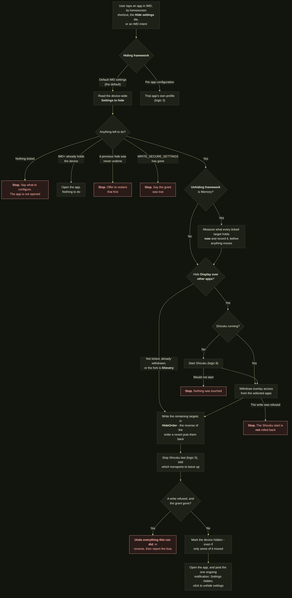</p>

### 2.2 Revert to default

The way back, reachable five ways so that losing the notification never strands you. The rule
here is the opposite of the one above: on the way out, putting four settings of five back is
strictly better than none, so a failure is reported rather than aborting the rest.

<p>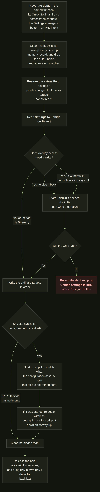</p>

### 2.3 Per app configuration - applying a profile

The precise tool: one profile per app, applied on launch, and what reaches it is the **hiding
framework** set to *Per app configuration*. What it records is the point - the values your
device really had, not the values the profile guessed it would have - and it records them only
where this app is the first to move a setting away from that value, so two apps cannot each
claim to have found it in a different state.

<p>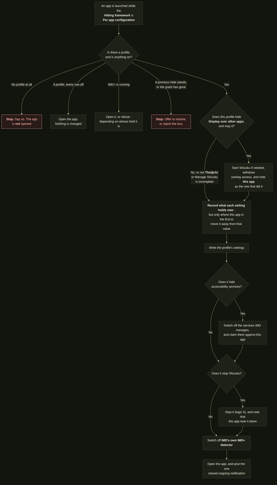</p>

### 2.4 Per app configuration - reverting a profile

The counterpart, and the one place the app's memory is spent. Note the overlay branch: only the
app that actually withdrew overlay access gives it back, so a second app that found it already
withdrawn does not hand back something it never took.

<p>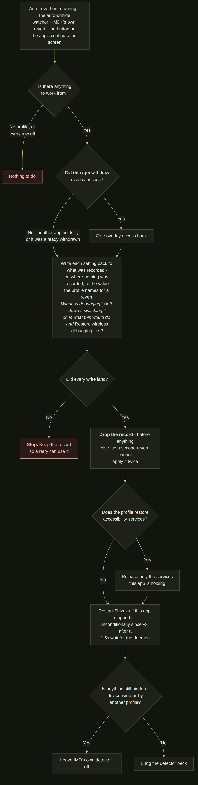</p>

### 2.5 Stopping the Shizuku service

Off by default, in both the device-wide settings and the per-app templates. It exists because a
fork's watchdog can restart the service mid-session, and starting the service turns ADB back on
- which is exactly the state a locked-down app is looking for.

⚠ **The transports are not a fallback.** The stop intent goes first, and then USB and wireless
debugging come down anyway - the service cannot outlive the transport it rides on, so this is
the part that actually does the work. There is no confirmation poll: v3 removed it. And on
**Shevery** nothing is sent at all, because that fork has no intents to send.

<p>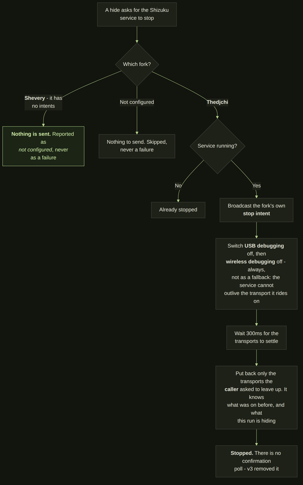</p>

### 2.6 Display over other apps

The only setting here that is not a settings row at all - it is an AppOp held per package,
written through Shizuku. Everything about this logic is built around one promise: the
permission goes back to exactly the apps it was taken from, and to no others.

<p>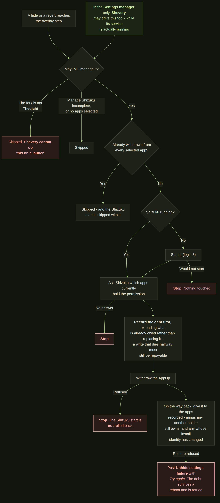</p>

### 2.7 Accessibility services

Only the services you picked in IMD settings are ever touched - so a revert can never switch on
something you disabled yourself.

⚠ **The claim is wider than "what was on".** It also takes a service already held by another
profile, on purpose: without that, the other profile's revert could switch one back on in the
middle of a hide. And a device-wide revert releases *every* holder rather than only its own -
scoping that is what caused the bug this behaviour was written to fix.

<p>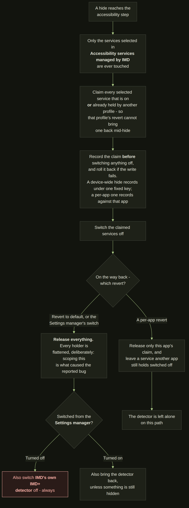</p>

### 2.8 Starting the Shizuku service

On **Thedjchi** a broadcast, not a command: the fork is free to ignore it, so this confirms
rather than assumes. It is why a launch that needs Shizuku shows a spinner - eight silent
seconds reads as a hang.

⚠ **On Shevery there is no broadcast at all.** IMD switches the debugging transports on and
waits up to forty seconds for that fork's own ErrorProtect watchdog to notice and start the
service, then puts back exactly the transports it raised if nothing came up. It is the one
start in the app that changes the device in order to ask, which is why it is the one that owes
a rollback.

<p>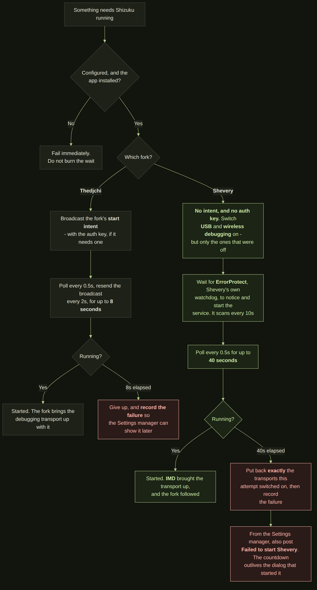</p>

### 2.9 The Settings manager

The dialog that opens without the app itself having to be open - through its own launcher icon,
a Quick Settings tile, a homescreen shortcut, the Favourites tab, or an IMD intent. Every row
is read live and re-read twice a second, because all of these can be changed from outside this
app.

Which rows appear is yours to choose, under *Setting manager toggles*, and their order follows
the Shizuku fork. ⚠ **A fork that is not configured does not grey its row out - the row and the
overlay row leave the card entirely**, which is the author's instruction and the opposite of
what this diagram used to show.

<p>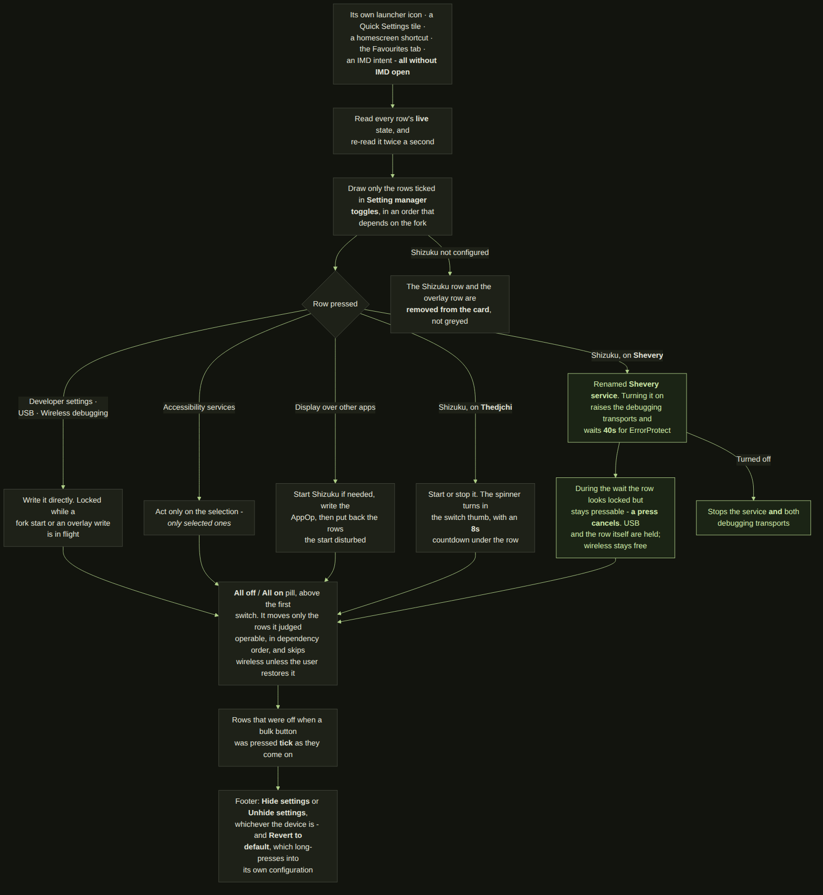</p>

### 2.10 Auto Revert on returning

Off by default. For people who always come back to IMD after using the app they launched.

<p>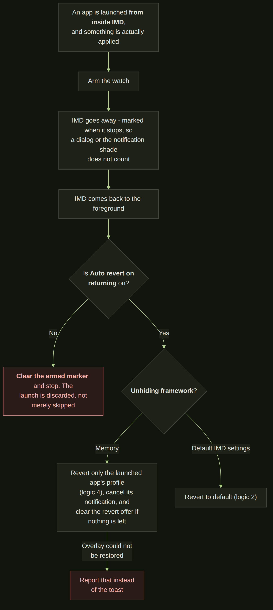</p>

### 2.11 IMD intents

Off by default, and every broadcast is refused - silently - until both the switch and the auth
key agree. ⚠ **Opening the Settings manager is the exception**: it is an activity rather than a
broadcast, it carries no auth key, and the integration switch cannot refuse it, because all it
does is put a screen in front of you that you then operate by hand.

<p>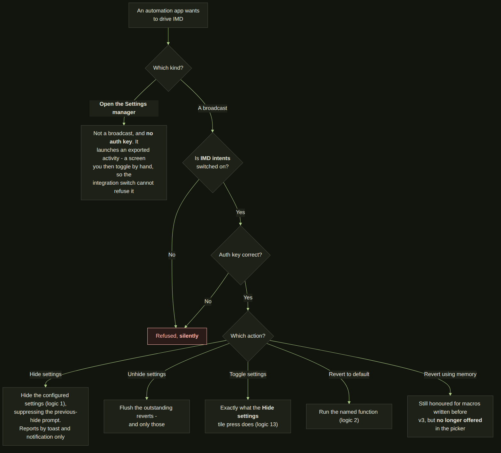</p>

### 2.12 Settings observer

The diagnostic tool: it tells you which settings a stubborn app actually reads, so you can
build a profile for it instead of guessing.

<p>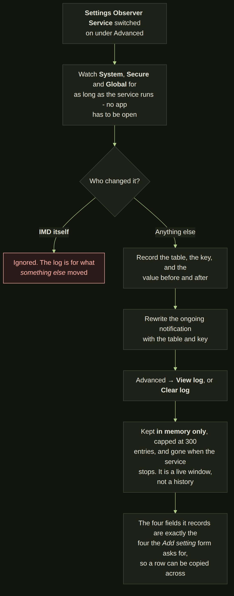</p>

### 2.13 Hide settings tile

The only control here with a state rather than an action. What it shows is written by the hide
and by every revert, wherever either was run from, so it is never a stale picture of a device
somebody has since put back by another route - and what a press does is decided from that same
record rather than from what the tile happened to be drawing.

<p>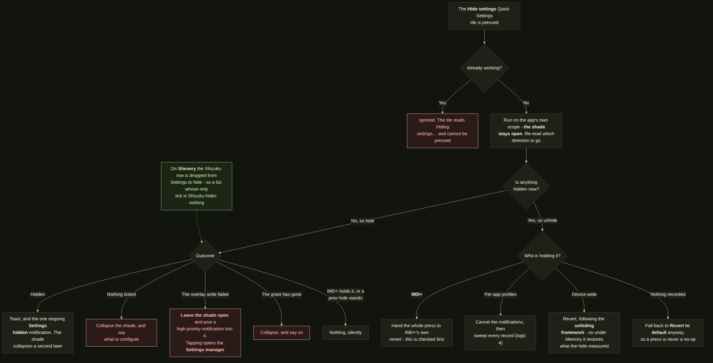</p>

### 2.14 Auto-hide settings (IMD+)

The only logic here that starts without anybody pressing anything, which is why it is the only
one with two guards drawn on it rather than one. The first is at the top: IMD+ refuses to start
while anything is already hidden or any revert is still owed, because a run on top of one of
those leaves settings that neither revert puts back. The second is in the middle: IMD switches
off **its own** accessibility service before it reopens the app - without that, reopening the app
is another app coming to the foreground, which is precisely what the detector listens for, and
IMD+ would chase its own tail forever.

Note also what the revert does *not* do. It closes no apps, so it needs Shizuku only if overlay
access has to be written; on a device with no overlay work to do it finishes in a moment.

<p>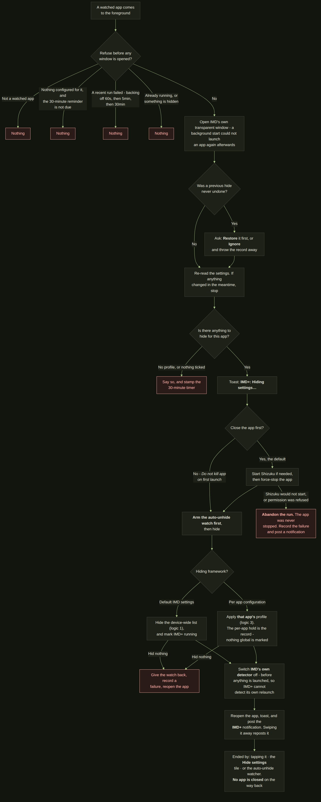</p>

### 2.15 Auto unhide settings

The other half of the pair above, and the one that needs no notification tapped: it watches for
the moment a hide has served its purpose and puts the device back on its own.

There are three triggers - the app swiped away from recents, the app left alone for longer than
a timer, and the screen locked for longer than a timer - and two conditions saying which kinds
of hide they apply to. ⚠ **Which condition is read is inferred, not stored.** A hide that named
an app leaves a watch entry, so it is an app-launch session; a hide from the tile names nothing
and leaves none, so it is a tile session. That is also why the screen-lock trigger is the
failsafe and cannot be switched off while the tile condition is on: a tile session has no app
to watch, and screen lock is the only thing that could ever end it.

Two things degrade rather than fail. Without the DUMP permission the swipe trigger simply never
fires; without usage access the idle timer measures from the hide instead of from when you last
used the app.

<p>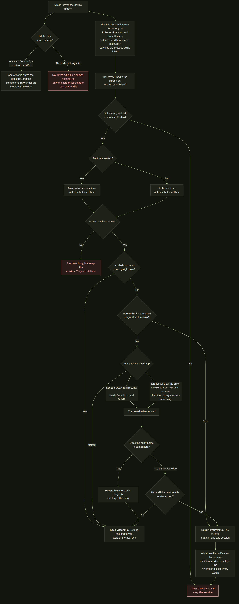</p>

---

## 3. Version history

Every version below was built by soul_99 in Android Studio, signed with his own keys, and
installed and used on his own phone before release. Anything under **Broke** was found that
way unless it says otherwise - this list is what testing turned up, not a list of things
that shipped broken.

Newest first. Every release gets an entry here, including the ones that only change
documentation.

### v3 - 3 September 2026 · versionCode 17

The release where IMD stops needing to be told. Every version before this one hid settings because
somebody pressed something - a tile, a shortcut, a row in the app - and put them back the same way.
v3 adds the other half at both ends: **auto unhide settings** ends a hide without a press, and
**auto hide settings (IMD+)**, begun in v2.4, is now reliable enough to be one of three automations
rather than an experiment.

It is also the release that stopped treating hiding and unhiding as one setting, which is the
change most of the rest of this entry follows from.

**Added - Auto unhide settings**

A hide now ends on its own. The watcher takes one of three signals - the app you launched being
closed, the screen locking, or your returning to IMD - and reverts when it sees one, with a silent
ongoing notification saying it is running and going away when everything is back.

- **The notification cannot be swiped off.** It is the only visible sign that the device is not as
  you left it; a user who dismisses it and forgets has no way of knowing. It comes back while the
  session is live.
- **It ticks every 5 seconds while the screen is on and every 30 while it is off.** The revert
  wants to be prompt, and a poll in a pocket wants to be cheap; those are different numbers, so it
  is two.
- ⚠ **A session kind the user has switched off settles rather than waiting.** The gate was right
  from the start but its disallowed branch answered "not settled", so the service stayed up and
  reached the same line every fifteen seconds for the whole hidden window. Answering "settled" is
  correct because the answer cannot change: the kind is fixed the moment the hide names an app or
  does not.

**Added - hiding and unhiding are two frameworks**

*Hiding-unhiding mechanism* is gone, replaced by a **hiding framework** (IMD defaults, or per app
configuration) and an **unhiding framework** (revert to default, or memory function), both at the
top of Advanced and each row reading *using X*.

- ⚠ **This is the fix for a bug, not only a preference.** Hiding device-wide on the memory function
  used to apply the *configured defaults* on the way back rather than restoring what the device
  actually was - so on a new install, every tile hide put back something nobody had chosen. The
  device-wide hide now records real state, and the revert is carried out by **the framework that
  did the hide**, not by whichever one is selected when the revert runs.
- Existing setups migrate without being asked: *revert to default* becomes IMD defaults + revert to
  default, *memory* becomes per app configuration + memory function. New installs start on IMD
  defaults + memory function.
- A revert now also restores anything a per-app profile hid that is not one of the six default
  targets, before the defaults are applied.

**Added - recovering from a force close**

If IMD is force-stopped while settings are still hidden, the next launch offers to restore them
first or to ignore every outstanding revert - on all six ways in: the apps list, favourites, the
per-app screen, a pinned shortcut, IMD+, and opening IMD itself. A spinner covers the restore, one
per window.

⚠ **The dialog cannot be dismissed by a back press or a tap beside it.** Both used to run the
destructive answer, which discarded real holds - the one dialog in the app where the cheapest
gesture was the irreversible one.

**Added - the permission is reported when it goes**

Losing `WRITE_SECURE_SETTINGS` used to be silent on a shortcut hide, swallowed by IMD+, and a dead
switch in the settings manager. It is now a popup on every route that can hide - both in-app
launches, the tile, the pinned shortcut, IMD+, the manager, and a notification for IMD intents -
and anything that run had already hidden is undone.

⚠ **A popup rather than IMD coming to the foreground.** The failure happens while you are in
another app; dragging IMD over it to deliver the news is worse than the news.

**Changed - the settings manager**

Renamed **IMD Settings Manager**, and rebuilt around it: a frosted window, Material 3 switches with
a hand-drawn tick, the whole row tappable rather than only the switch, **All on / All off**, a red
line while a revert is outstanding, external-link icons on the rows that have an Android page, a
**Manage Shizuku** master switch that removes the Shizuku and overlay rows on a device without it,
and a countdown while the Shizuku service starts - 8 seconds on Thedjchi, 40 on Shevery.

Rows are locked while any hide or revert runs, with a line above them saying which. They were
pressable during an IMD+ run, a shortcut launch or a notification revert, which let a user write
into the middle of a write.

**Changed - the words**

*IMD services manager* → **IMD Settings Manager** (tile and shortcut: *Settings manager*); the
first-run screen reads **IMD - It's My Device**; IMD+ is **(needs background service)** rather than
EXPERIMENTAL; **IMD intents** dropped its EXPERIMENTAL tag; and the About page says **Supercharged
fork of** rather than *Fork of*.

**Changed - the other ten languages**

About 1,500 strings written across Hindi, Arabic, Portuguese (BR), Simplified Chinese, German,
Spanish, French, Japanese, Korean and Russian, taking each locale from roughly 80% to essentially
complete.

⚠ **The in-app "where to find this" trails are assembled, not translated.** Each row is named
exactly as that language's own Android settings screen names it, and the trail is built from those
names - Arabic with the right-to-left arrow and the app name second. A translated *sentence*
describing a path is not a path.

⚠ **The six Shizuku setup step lines stay in English on purpose.** They are read against Shizuku's
own settings screen, which is English-only.

**Changed - the look and the cost**

Dynamic (wallpaper) colour and progressive blur are both on by default; anyone who had turned
either off gets it back once and their next choice sticks. The dark theme's `primary` moved from
`#B3E675` to `#8FAE6E` - the old one was a yellow-green at high lightness *and* high chroma, which
is the definition of a highlighter, and six switch tracks stacked in one dialog was where it showed.
The settings manager's two buttons and the Favourites manager button moved onto that same `primary`;
there had been three greens.

Scrolling the settings page no longer re-runs the whole body every frame, and the blurred header's
effect graph is cached rather than rebuilt per draw.

**Fixed**

- **The IMD+ open-and-close loop.** A hide that could not complete left IMD+ killing and relaunching
  the app forever. It now tries once, then waits 1 minute, then 5, then 30; a success clears the
  wait, and switching IMD+ off and on clears it immediately.
- **Revert to default restored three of its six targets.**
- **Auto unhide reverts were cut short** - the settings were written, the notification never cleared
  and no toast appeared.
- A device-wide memory revert restored whatever was true at the *first* hide, for ever; the record
  is now cleared by the revert that used it.
- A hide from the tile with the quick-settings trigger on and the screen-lock trigger off could
  never be reverted, and its service never stopped.
- Accessibility services and *Display over other apps* could be stuck off in the manager, doing
  nothing when switched on by hand, when IMD held no record.
- The tile could show a stale label, get stuck after a hide, or flash the wrong label on the way
  through a revert; it is now told about hides and reverts that happen outside the shade.
- A Shevery wait died when its dialog was dismissed; a Shizuku row that was still starting opened
  the *unavailable* dialog.
- Settings screens open on more devices - IMD tries a list of candidate destinations rather than one.
- Creating a shortcut by long press no longer hangs silently; a Retry appears after 8 seconds.
- Legacy-style app icons showed a hairline along their bottom and right edges - a float `RectF`
  whose half-pixel edges the rasteriser rounded inward on exactly two sides.
- Three separate bugs with the switch tick, all one cause.

**Broke**

Four builds failed on the author's machine during r29, and each one is a lesson worth keeping:

- **`androidx.baselineprofile:1.5.0` does not exist.** The version was guessed and shipped flagged
  but unverified. 1.4.1 is stable and **1.5.0-rc02** heads the 1.5 line; the RC is pinned
  deliberately, because the 1.5 notes say it no longer needs `newDsl=false` under AGP 9.
- **A child project may not name a version for a plugin already on the root classpath.** build-logic
  puts AGP there as a plain dependency, so `com.android.test` must be applied by bare id - which
  every one of the other twenty-nine modules already did, evidence that was in the repo and unread.
- **aapt2 refused the whole resource table** over `values-fr.xml`: `Services d\\'accessibilité`.
  ElementTree resolves XML entities but knows nothing of Android's backslash escapes, so a value
  read back out of an already-translated file still carried its `\'` and the writer escaped it
  twice. Fixed at the read/write asymmetry, and `check_escapes()` in `tools/check_translations.py`
  now reads the raw file, because every existing check went through ElementTree and none of them
  could see it.

⚠ **The baseline profile has never been generated.** The module and the wiring are here and
`assembleRelease` succeeds without a profile, so the APK simply ships without one. It needs one run
on a device - see `baselineprofile/README.md` - and the output committed.

⚠ **Arabic still renders `%1$d` as ٠١٢.** `Resources.getString` formats against the config locale
and `ar` carries the `arab` numbering system, so the digits are substituted after the string is
built. Fixing it is a change at each call site, touching strings that have already shipped.

### v2.4 - 28 August 2026 · versionCode 16

The release that lets IMD act on its own. Everything before this needed a press: a tile, a
shortcut, a tap on an app inside IMD. **Auto-hide settings (IMD+)** is the first thing in this
app that starts without one, and the whole design follows from taking that seriously.

There is no versionCode for a v2.3. The IMD+ work was specified as v2.4 while v2.2 was still
the current release, and the number was kept rather than renumbered mid-build.

**Added - Auto-hide settings (IMD+)**

Pick the apps you want protected. When one of them comes to the front, IMD force-stops it
through Shizuku, hides whatever *Settings to hide/ disable* names, and opens the app again -
so the app starts having never seen the settings it objects to. A notification stays in the
shade and puts everything back on a tap.

- **The detector reads one thing.** Its accessibility service asks for `typeWindowStateChanged`
  and deliberately **not** `canRetrieveWindowContent`: it needs the package name of whatever is
  in front and nothing else, and an accessibility service that can read screen content is a
  very different thing to install than one that cannot. Android's own accessibility list shows
  it as *IMD+ (autohide settings)* with a description saying exactly that.
- **It switches itself off mid-run.** Reopening the app is another app coming to the
  foreground, which is precisely what the detector listens for - so left running it would
  detect its own relaunch and start over forever. The run switches the detector off before it
  relaunches anything. That is a state rather than a timer: nothing depends on how long a kill
  or a launch takes on a given device. It comes back on the revert, recorded as an ordinary
  accessibility hold.
- **The run happens inside a transparent window of IMD's own**, and that is a requirement
  rather than a decoration: starting an app from the background is refused on Android 10 and
  up unless something exempts the caller, and the exemption an accessibility service would have
  given is the very thing the run has just switched off. The window also carries the Shizuku
  spinner, so the wait reads as work rather than as a tap that did nothing.
- **Switching the service on tries three things in order**, without asking: the secure setting
  first; then, if the system declines to bind it, Shizuku is used to allow the restricted-
  settings AppOp - which from Android 13 a sideloaded app's accessibility service cannot be
  switched on without, by anybody - and the write is repeated. Only if both come to nothing
  does a popup name the two things a person can do by hand. Nothing here trusts the write's
  return value: what counts is whether the system actually bound the service.
- **One checkbox, and it decides the Shizuku question.** *Do not close the app on the first
  launch* is the only exception, and because force-stopping the launched app is the only thing
  IMD+ asks Shizuku for on its own account, ticking it removes the Shizuku requirements
  entirely.
- **The revert closes nothing.** It hands straight to *Revert to default*, which starts Shizuku
  only if overlay access actually has to be written and otherwise settles it at the very last
  step. A revert with no overlay work to do now finishes in a moment rather than after a wait
  for a shell it never used.

**Changed**

- **IMD's own accessibility service is now switched off by every hide**, from any route -
  a launch inside IMD, a pinned shortcut, the tile, an intent - whether or not *Accessibility
  services* is ticked, and only when the hide actually hides something. It is restored by
  *Revert to default*, or by the last of the pending per-app reverts under the memory function.
- **IMD+ will not start while any revert is still outstanding.** The switch reads off for that
  whole period and says why.
- **A launch from inside IMD while IMD+ is running** either opens the app with no notification,
  because everything it wanted hidden is hidden already, or is refused and says why - when a
  per-app profile asks for something IMD+ is not holding, satisfying it would leave settings
  that neither mechanism's revert puts back.
- **Every dialog in the app is capped and centred on large screens**, and fills the width on a
  phone. Android's own dialog width is a fraction of the screen, which is the wrong way round
  in both directions: it left dialogs narrower than a phone and wider than they should ever be
  on a tablet. The width is decided in `DialogContainer` now, once, for all of them.
- **The services manager's accessibility switch no longer touches IMD's own detector**, in
  either direction. That switch stands for the services the *user* picked; the detector is
  switched off by every hide whatever the selection says, and only a revert puts it back.
- **A revert to default switches the detector back on** rather than only releasing the hold, as
  long as IMD+ is configured on - so a record lost to a crash or an outside change cannot leave
  IMD+ silently deaf until somebody opens the settings screen and notices.
- **A new Revert to default icon**: the tick is gone and the arrow is smaller and heavier, so
  it still reads at quick-settings size. Regenerated across the tile, the shortcut, the
  design-system glyph, the themed icon and the mipmaps.

**Broke**

- Nothing new found in testing at the time of writing.

### v2.2 - 27 August 2026 · versionCode 15

Two releases in one. v2.1 was built, tested and never published: the crash below was found in
it, and by the time that was fixed the quick settings toggle and the notification rework had
landed on top, so both went out together as v2.2. There is no versionCode 15 that is only
v2.1.

**Fixed - the app could not start at all on Android 12 or below**

Since the language feature shipped in v1.6.5, every device from Android 7 to Android 12 has
died before a line of the app ran:

```
java.lang.RuntimeException: Unable to instantiate application com.android.geto.GetoApplication:
java.lang.NullPointerException: Attempt to invoke virtual method
  'android.content.SharedPreferences android.content.Context.getSharedPreferences(...)'
  on a null object reference
    at com.android.geto.GetoApplication.attachBaseContext
```

`AppLocale.prefs()` read the chosen language through `context.applicationContext`, and it is
called from `Application.attachBaseContext` - where the Application has not been attached yet,
so `getApplicationContext()` answers null. The wrapper returns early on Android 13 and up,
which is exactly why it was never seen: the only devices it was tested on are Android 13+. It
now uses the context it was handed, which is a full context with the right data directory, and
SharedPreferences are cached per file per process so it is the same one-key file either way.

Reported by a user on a realme RMX2040 running Android 11. Nothing they did caused it and
nothing they could have done would have avoided it.

**Added**

- **A "Hide settings" quick settings tile.** The third tile, and the first with a state rather
  than an action: it shows whether IMD is hiding anything right now - reading *Settings
  visible* or *Settings hidden* - hides on a press and unhides on the next. It follows a revert
  fired from anywhere - a notification, an intent, the home-screen shortcut, the other tile -
  because what it reads is written by the hide and by every revert, not by the tile.
  Long-pressing it opens the services manager.
- **Nothing configured to hide is now said out loud.** Pressing the tile with an empty
  "Settings to hide" leaves it off, collapses the panel and says what to configure, rather than
  appearing to do nothing.
- **Stop the Shizuku service as part of hiding**, device-wide and per app. The fork's own stop
  broadcast first, then a poll, and if the fork ignores it, USB debugging is dropped for a
  moment - which takes adbd and Shizuku with it - and put back only where it belongs. The blunt
  path raises its own warning, because it cannot be undone as cleanly on the way back.
- **The Shevery fork family.** Shevery has no start or stop intents; it follows the debugging
  transport and its own ErrorProtect watchdog. Seven controls that only make sense with intents
  are hidden on it, and choosing it is only committed after its notice is read.
- **`CONTRIBUTING.md`** at the root of the repository.

**Changed**

- **A fresh install hides nothing and unhides nothing.** Both default configurations start
  empty, so an install nobody has configured cannot change a device on its own. Existing
  installs are untouched: a one-shot migration writes the old defaults down as the answer for
  anyone who had never opened the dialogs, and frozen copies of those old defaults live in the
  source so a later change cannot rewrite history.
- **A launch with nothing ticked is refused** rather than opening the app with every setting it
  objects to still on - which looked like IMD doing nothing. All apps, Favourites and pinned
  shortcuts all say where to configure it.
- **The revert notification is ongoing, says one fixed line, and reverts on tap.** No button to
  find, no wording that depends on which app was launched, and no way to lose it by accident:
  from Android 14 an ongoing notification can still be swiped away, so a swipe re-posts it. A
  revert cancelling the notification itself does not, so a finished revert is final.
- **A channel each for the two revert notifications**, so either can be silenced or sorted in
  Android's own settings without touching the other or the observer service.
- **"Notification function" is now "Hiding-unhiding mechanism"**, and its Save button is now
  **Re-launch app**: changing which mechanism hides and unhides settles whatever the old one
  still had outstanding, then starts the app over, because several screens read the mechanism
  as they are composed.
- **"Tasker / MacroDroid integration" is now "IMD intents (EXPERIMENTAL)".**
- **The Shizuku start action is pre-filled and written down**, not merely displayed. A field
  showing a default while storage held a blank made the app report itself unconfigured with
  every box apparently filled.
- **Launching a second app no longer redoes work that is already done.** Overlay access that
  IMD has already withdrawn is not withdrawn again, which is what used to cost twenty seconds
  of starting and stopping Shizuku - and sometimes a USB-debugging warning - on every repeat
  launch.
- **About is no longer a chain of link icons.** Only the coloured text is clickable; the two
  rows inside the soul_99 dialog keep their marks.
- **The overlay picker opens instantly** on a cached list, and asks the system for labels only
  for the packages it is going to show rather than rasterising every app on the device.
- The help page says nothing is hidden by default and that you must configure it first; the
  shortcut's "nothing configured" dialog says **long press** on the app name.

- **The services manager's "Display over other apps" row now behaves like the accessibility
  one.** With no app selected it reads off, refuses to move, and says which screen to go to,
  rather than reading "on" - which described the device rather than anything IMD was doing, on
  a switch that could not have done anything about it either way.
- **Both revert notifications show their whole line.** They were a title, which is one line
  tall and cut off on a narrow screen - taking the half that says what a tap does with it.
- **A re-posted notification looks like the one that was swiped away**, app icon and all: it is
  fetched from the system rather than carried through the notification's own extras.
- **The settings template dialog stays open** while you add rows to a profile, and closes on
  back or a tap outside like every other dialog.
- **Leaving an app's configuration page goes back where you came from** instead of always
  landing on Settings.
- The Version row is now **App version**, and the empty Favourites tab says one thing.
- **The Revert to default notification carries the "settings hidden" glyph** rather than the
  app's own logo - the same struck-eye drawing the Hide settings tile shows, in the coloured
  pair the other IMD icons use. What the notification is about is that settings are hidden;
  the logo only said which app had posted it, which the header says anyway.
- **Pressing the tile no longer flashes the screen.** The window it opens is usually invisible
  and finishes at once, but it was themed like the services manager - which dims the screen
  behind it. No dim, no window animation, no starting preview.

**Broke, and was fixed before release**

- The overlay list took ten to fifteen seconds to open: `repeat { … return@repeat }` is
  `continue`, not `break`, so the read ran six times whatever happened.
- The redetect button reported "no app found" on the first press and worked on the second - a
  fixed ceiling raced the app scan. It now waits on a count of completed reads, because a
  "loading" boolean is observed through a collector and a waiter can see a stale `false`.
- Fork detection was dead twice over, each time because its guard asked about a value the
  preferences layer fills in. A blank start action is the only honest sign that nothing has
  been configured.
- **A second app's revert undid the first app's hide.** Launch one app that withdraws overlay
  access, then a second that is configured to withdraw it and finds it already gone, and
  reverting the *second* handed the permission back - starting Shizuku to do it and leaving
  the debugging transport on behind it - while the first app was still open. The launch now
  writes a per-app note when it is the one that did the withdrawing, and only that note earns
  the undo. The same rule Shizuku's own stop has followed since v2.0.
- **A standing "open Settings" request re-fired on every return.** The request that opens the
  Settings tab from outside the navigation graph was read as a state rather than an event, so
  once one had arrived, backing out of any app's configuration page bounced the user onto
  Settings - and re-opened the revert configuration dialog with it. Both now fire once per
  request, against a mark that survives the screen leaving composition.

### v2.0 - 25 August 2026 · versionCode 14

The first release with code in it from someone other than soul_99. RafayGhafoor (Muhammad
Rafay Awan) opened a pull request adding **Display over other apps** to the settings IMD can
hide, and it was merged whole; the changes below are the ones made on top of it before
release, and the reasons for each.

**Added**

- **Display over other apps can be hidden.** Some banking apps refuse to run while any app is
  allowed to draw over them. IMD now withdraws that permission through Shizuku from every app
  currently holding it, records exactly which ones it took it from, and gives it back to
  exactly those on Revert - never to an app that has since been uninstalled or replaced, and
  never to one that never had it. Contributed by RafayGhafoor.
- **Shizuku is started automatically when overlay hiding needs it**, and the launch now says
  so. Overlay permissions can only be written while Shizuku is running, and a fork can take
  up to ten seconds to come up. A spinner with "Starting Shizuku service to hide Display over
  other apps permission" sits over the launch for that wait, so ten silent seconds no longer
  read as a hang.
- **A dedicated failure dialog** when overlay access cannot be reached, listing the two things
  that fix it: the Shizuku permission grant, and the fork configuration in IMD settings.
- **Contributions credit** in Settings → About, and in the README.

**Changed**

- **Accessibility hiding is back to the services you picked.** The merged version switched off
  every accessibility service enabled on the device. That is more thorough, and it is also the
  one thing this app has always refused to do: it turns off services the user never chose and
  gave them no way to exempt. Narrowed to the selection in Settings again. The improved
  bookkeeping that arrived with the pull request is kept - holds now extend across repeat
  launches instead of being replaced, and are persisted before the write rather than after, so
  process death cannot leave a service off with no record of why.
- **Display over other apps is off by default** in both Settings to hide and Settings to
  unhide on revert. It needs Shizuku, and a switch that is on by default on a device with no
  Shizuku is a launch that fails for a reason the user never opted into.
- **Both overlay toggles are greyed out until Shizuku is configured**, rather than tickable
  and then failing later. Greyed rather than hidden, so the feature is still discoverable.
- **The revert order is now fixed**: start Shizuku, unhide overlay access, write every
  WRITE_SECURE_SETTINGS setting to the configured state, then leave Shizuku running or stop it
  as configured. Starting a fork turns the debugging transport on by itself, so the settings
  have to be written after that rather than before, or the start quietly overrides the
  configuration. Hiding runs the mirror image: overlay first, then everything else. Nothing is
  ever forced on to make Shizuku startable - a fork brings its own transport up using its own
  WRITE_SECURE_SETTINGS, so switching debugging on and back off around it would only be moving
  settings the user did not ask to move.
- **A failed restore is now reported instead of being silent.** Losing overlay access is the
  one failure that leaves other apps changed with nothing on screen connecting it to IMD, so
  it gets three things: a notification carrying the fix and a **Try again** button, a red row
  with a red information icon in the services manager that stays red until a restore actually
  succeeds, and a stored flag so all of that survives a failure during a revert with no UI
  open. The retry never tries to start Shizuku - the notification has just asked the user to
  do that by hand, and spending another ten seconds failing the same way helps nobody.
- **The held-packages debt is only ever narrowed by what was actually restored.** It is the
  only record of which apps lost overlay access, so a failed attempt leaves it exactly as it
  was rather than clearing it.
- **Restoring overlay access from the services manager puts everything else back.** Doing it
  needs Shizuku, and starting a fork switches the debugging settings on by itself, so those
  rows plus Shizuku are locked for the duration and written back to their previous states
  afterwards. The user asked for one permission back, not for developer options to come on.

**Added later in the same version**

- **A per-app template for overlay hiding.** *Hide Display over other apps*, described as
  "needs Shizuku service", so the memory notification function can hide it per app rather than
  only device-wide. It carries the marker key `op_system_alert_window`, which is not a Settings
  row at all - it is filtered out of the plain write loop and handled through Shizuku, the same
  shape `accessibility_enabled` has had since v1.0.
- **The initialisation screen no longer says Shizuku is only needed once** without qualifying
  it. It now begins "Unless you want to hide Display over other apps permission also".
- **Overlay failures are told apart from settings failures.** A new AppSettingsResult means the
  launch can name the actual cause instead of showing "Unable to change settings", and a
  shortcut launch shows it too - before this, a shortcut whose overlay step failed simply did
  nothing at all and said nothing about why.

**Fixed after the user's first build**

- **KSP failed on `RevertToDefaultRunner`.** It had been given `UserDataRepository`, but the
  broadcast-receiver module does not declare `:domain:repository`, so Hilt could not resolve
  the parameter. The fact it needed was one boolean, so that now travels on
  `RevertToDefaultResult` instead - which is also narrower than `DisplayOverOtherApps in
  failed`, since that is equally true of a failed hide, and a failed hide needs no
  notification.
- **The overlay row read "off" whenever Shizuku was out of reach.** Its state came from a
  Shizuku query, and a failed query was being treated as "nothing is allowed". Two visible
  bugs from one cause: the row showed off on a device where apps did hold the permission and
  IMD had never touched it, and switching Shizuku off in the manager dragged the overlay row
  off with it. The row now reads this app's own held-packages record first - a non-empty debt
  is the only thing that means "IMD took it away" - and falls back to "on" rather than "off"
  when the live query cannot be answered, because Shizuku being unreachable says nothing about
  what apps hold.
- **Hiding overlay access from the manager now starts Shizuku too**, not just restoring it.
  With the row reading "on" more often, a user with Shizuku stopped is far more likely to press
  it *off*, and without the start that press failed silently and sprang back.
- **The two Favourites buttons swapped places and sizes.** Revert to default is now the primary
  floating button on the right; the IMD services manager is the small tonal one on its left.
- **The overlay row's red icon was smaller than the Shizuku row's** despite both asking for
  18.dp. The title was unweighted, so a long one - "Display over other apps" is the longest
  here - took the whole row and left the icon a few pixels to draw into, which `Modifier.size`
  honours by shrinking. The title is weighted now, so the icon is measured first.
- **A failed revert says so.** Three toasts, covering the only two targets that depend on
  something outside the app and so cannot simply be put right from the services manager:
  Shizuku alone, overlay alone, or both. Fired after the "Revert to default" toast rather than
  instead of it, so a revert that half worked does not look like one that never started. The
  per-app revert shows the overlay one too - it is the only place that failure is reported,
  since the overlay step is deliberately not allowed to fail the rest of the profile.

- **The settings observer keeps a log now.** It used to say only that *something* under
  System, Secure or Global had changed, in a notification the next change replaced before you
  could read it - enough to know an app was touching settings and useless for finding out
  which, which is the entire reason to run it. It now records the table, a readable label, the
  key, and the value it moved from and to: the four fields the Add setting form asks for.
  **View log** and **Clear log** sit on one line under the observer row in Settings. Kept in
  memory only, capped at 300 entries, and deliberately not persisted - the window that matters
  is while the observer is running, the foreground service holds the process up for exactly
  that long, and a log outliving the service would describe a device that has since moved on.

- **Auto Revert on returning**, near the top of Advanced and off by default. Launch an app from
  inside IMD, come back to IMD, and the device is put back without touching the notification.
  It runs whichever revert the notification function is set to, because the two are not
  interchangeable: Revert to default drives the whole device to a configured state while the
  memory function puts back only what one app's profile changed.

  Switching it on shows a notice first, with **I understand, turn it on** and **No, keep it
  off**. The third point is the one that surprises people and the reason the notice exists:
  returning to IMD *is* the trigger, so returning early puts the settings back while the app
  that needed them hidden is still open, and nothing can tell those two returns apart.

  Armed only in `AppLaunchEffect`'s Success branch - the one place where settings were applied
  and a launch left the app. A shortcut launch never reaches that file, which is what makes
  "only apps launched from within IMD" true rather than a promise. Fired on the activity's
  ON_START, and only after an ON_STOP has been seen: a dialog or the notification shade pauses
  the activity without the user having gone anywhere, and ON_PAUSE would have counted those.
  The marker is in memory, so a process death while the launched app is in the foreground
  means no auto revert on return - the safe way round, since a revert restored from disk would
  fire on some later cold start with nothing on screen to explain it.

- **Five configurations became full pages.** Settings to hide, Settings to unhide on revert,
  Notification function, the auto revert notice and the settings log all outgrew a dialog -
  each started as a short list and has been added to since, and a dialog is capped at the
  platform's dialog width and grows downwards until it is a scrolling sliver. `SettingsPage`
  gives them the shape the in-app help page has had since v1.5: back arrow and title on top,
  body scrolling between two dividers, actions on a fixed footer so Save never scrolls out of
  reach. Built on `DialogContainer(fullScreen = true)` rather than a navigation destination, so
  the state and callbacks those screens already had keep working and the system back gesture
  still closes them.
- **The settings observer start/stop row is a switch**, matching every other on/off row in
  Settings rather than being a tappable line that says "Start service".
- The Shevery line now ends "start-stop intents without auth key", and the About contribution
  line reads "(Display over other apps)".

- **The Shizuku wait says which way it is going.** The same ten seconds precedes hiding
  overlay access and giving it back, and the spinner said "to hide" during a revert - the
  opposite of what was about to happen. `ShizukuStartTracker` now counts the two directions
  separately and the dialog picks its line from that.
- **The revert failure notification is a persistent heads-up banner titled "Revert Failure"**,
  on a new IMPORTANCE_HIGH channel of its own. Tapping the body opens the services manager,
  which is where the failure can actually be dealt with; it is ongoing and does not clear on
  that tap, because overlay access stays withdrawn until a restore succeeds and a prompt that
  vanished on the first tap would be retiring a problem that has not gone away. It could not simply be the existing channel turned up:
  channel importance is fixed at creation, so every install since v1.0 would have ignored the
  change. A separate id also lets the user quieten failures without losing the ongoing Revert
  notification, which is the one they actually need.

- **Only the apps you picked lose overlay access.** The merged version took the permission
  from every app currently holding it, which is the same over-reach the accessibility path
  had and was narrowed for: it switches off things the user never chose and gives them no way
  to exempt one. There is now a **Display over other apps to hide** picker under Default IMD
  settings, listing the apps that hold the permission, and hiding touches only what is ticked
  in it - device-wide memory of overlay access is gone. The picker refuses to open on a guess:
  the list can only be read through a running Shizuku, so a failed read shows "Needs active
  Shizuku service to configure" rather than an empty list that would read as "you have
  nothing to choose from".

  The debt is keyed the same way the accessibility debt is - by whoever incurred it, an app's
  component name or the device-wide marker - so a package stays withdrawn until every holder
  has released it, and repeat launches extend a hold instead of replacing it. Both debts live
  in the proto DataStore and are written before the permission is, so an update, a force stop
  or a reboot leaves the record intact and the services manager can still put everything back.

- **Overlay management has a master switch**, first in Advanced, off by default, titled
  **Manage 'Display over other apps'** and described as "needs active Shizuku service". With
  it off no overlay row is drawn anywhere: the one in Settings to hide, the one in Settings to
  unhide on revert, the picker under Default IMD settings, and the row in the IMD services
  manager. This is the only thing IMD touches that cannot be written without a working Shizuku
  service, so on a device without one every one of those rows is a control that can only fail -
  and greying them out says "go and configure Shizuku" to someone who has decided not to use
  the feature at all.

  Taking the manager row away costs the red row a failed restore used to turn on, so the two
  remaining ways back were checked rather than assumed. The revert failure notification is
  `setOngoing(true)` and `setAutoCancel(false)`, so the tap that opens the manager does not
  clear it: Shizuku can be started from its row there, or from that row's arrow out to the
  Shizuku app, and the notification is still in the shade afterwards with **Try again** on it.
  That retry restores from the persisted debt through `OverlayRestoreRunner`, not through any
  screen. And **Revert to default** - from the manager, the tile, or the ongoing revert
  notification - still hands overlay access back with the switch off, because the debt is
  still owed. The second one is what survives the user swiping the notification away, which
  Android 14 permits even on an ongoing notification.

  Switching it on shows a one-line notice every time, not once, pointing at the three rows
  that have just appeared: switching the feature on and leaving all three alone looks enabled
  and hides nothing, and someone turning it back on months later has exactly the same three
  things to check.

  Hiding is gated on the switch and restoring is deliberately not - see
  `UserData.effectiveRevertDefaults`. Turning the feature off has to stop IMD taking overlay
  access away, but a debt taken while it was on is still repaid by the next revert. The
  alternative is an app left without a permission IMD withdrew, with every screen that could
  give it back now hidden. The stored ticks are left alone too, so switching it back on
  returns the configuration as it was left rather than blank.

- **A failed overlay step can no longer abandon the rest of a revert.** The order was already
  right - overlay, then the four WRITE_SECURE_SETTINGS targets, then Shizuku, and only then
  does the caller raise the failure notification - and a *refused* overlay write already fell
  through to the rest. A *thrown* one did not. Both the overlay and Shizuku branches end in a
  binder call to a service that can die between the check that it is alive and the call
  itself, and a dead binder throws rather than returning: that exception escaped
  `RevertToDefaultUseCase`, skipped four settings the app could perfectly well have written on
  its own, and skipped the notification too, because the caller never reached the line that
  raises one. Worst case, the device was left half-reverted with nothing on screen saying so -
  which is the exact state the revert exists to prevent.

  Fixed in two places, both narrow. `SetManualTargetUseCase` now returns false instead of
  throwing, for every target rather than only the WRITE_SECURE_SETTINGS ones, which is what
  its Boolean return was always claiming. And the overlay block in `RevertToDefaultUseCase` is
  wrapped whole, so a throw is recorded as "overlay access did not come back" - identical to a
  refusal, because to the user they are the same event - and the revert carries on. The same
  wrapping went on the per-app revert, whose comment had claimed this guarantee for two
  versions without the code enforcing it.

  Hiding keeps the opposite rule on purpose: `ApplySettingsToHideUseCase` still gives up the
  moment Shizuku cannot be started. The asymmetry is real. On the way in, hiding four settings
  out of five is useless - the app detects the fifth and refuses to run, and the device has
  been changed for nothing. On the way out, restoring four out of five is strictly better than
  restoring none.

- **A Shizuku start is not attempted twice in one revert.** The overlay step is the only thing
  in a revert that starts Shizuku, and the last thing a revert does is settle Shizuku to its
  configured state - so a device where Shizuku will not start used to be asked twice, ten
  seconds each time, and reported it as two separate problems. The refusal is now carried to
  the end: the final step does not ask again, and records the start as failed instead. One
  refusal, one failure, and the user hears about it once - in the toast that names Shizuku and
  overlay access together rather than in two that describe the same event.

  Only when the configuration wants Shizuku *on*. "Leave Shizuku off" is satisfied by a
  Shizuku that would not start, so that is an end state reached rather than a failure. And the
  refusal is read from the device after the wait rather than from what the start call
  returned, so a fork that comes up late still counts as having started.

- **A failed overlay hide no longer switches anything else off.** Overlay access used to be
  the first item in the device-wide hide loop, and a failure only set a flag - the loop went
  on to switch off accessibility services, wireless debugging, USB debugging and developer
  options, and *then* the launch was cancelled. The user was left in front of an error dialog
  with their device locked down for an app that never opened, and no obvious connection
  between the two. Overlay is now done before the loop and every way it can fail returns
  immediately, so nothing is hidden. This is what the per-app path already did; the two agree
  now.

  Hiding and reverting take opposite rules, and both are right. On the way in, hiding four of
  five settings is useless - the app detects the fifth, refuses to run, and the device has
  been changed for nothing. On the way out, restoring four of five is strictly better than
  restoring none.

- **The hide loop no longer works from a snapshot Shizuku has already invalidated.** Found
  while making the change above. The device state was read once at the top, then Shizuku was
  started for the overlay step - and starting a fork brings the debugging transport up with
  it. Against that stale copy, developer options and USB debugging which Shizuku had *just
  switched on* still read as off, so the loop skipped them as nothing to do and the app opened
  with both of them plainly visible to it, reported as a success. The state is re-read after
  the overlay step now, which is the same thing `RevertToDefaultUseCase` has always done in
  the other direction and for the same stated reason.

- **The per-app config screen hides overlay controls while overlay management is off.** With
  "Manage Display over other apps" switched off in Advanced, [ApplyAppSettingsUseCase] stops
  acting on the overlay marker - so a per-app profile that still showed a "Hide Display over
  other apps" row, or still offered the template to add one, was promising the memory function
  a hide it would not perform. Both now disappear from that screen while the feature is off:
  the template is dropped from the picker, and any row already added stops being shown. The
  filter is on the view only - the Room row and the asset template are untouched, so every
  such row comes straight back, in each app it was added to, the moment the feature is switched
  on again. Nothing is deleted and nothing has to be re-added. The rule matches the device-wide
  dialogs one level up, so overlay controls are now present everywhere or nowhere, never shown
  in one place while dead in another.

- **Starting and stopping Shizuku works again when the fork's app is closed but its service
  is running.** A build during v2.0 changed the start/stop broadcast to resolve the target
  receiver with `queryBroadcastReceivers` first and refuse to send if none came back. That
  query only sees *manifest* receivers, and the case it broke is the common one: a fork whose
  app is closed but whose service is alive handles start and stop through a receiver the
  service registered at runtime, which the query cannot see. So the broadcast was never sent -
  the services manager could not stop a running Shizuku or start a stopped one, and overlay
  hiding, which starts Shizuku through the same path, failed with it.

  The broadcast is now sent package-scoped, exactly as it was before the regression, so it
  reaches every receiver the fork exposes - the manifest one and any the running service
  registered at runtime. The receiver query is kept as a log line and nothing more, never a
  gate; pinning the broadcast to the single manifest component with `setClassName`, which the
  broken build also did, is gone too, because that would exclude the very runtime receiver
  this case relies on. `StartShizukuUseCase` still confirms a start by polling the real
  running state, so nothing now depends on the broadcast reporting its own success.

- **Turning accessibility services back on from the services manager works again.** Switching
  them off from the manager recorded a device-wide hold correctly; switching them back on only
  released *that* holder and treated every other as a reason to keep a service off. Because a
  launch always claims a service the manager already switched off - it is in the debt held "by
  others" - the device-wide hold was shadowed, and releasing just it found everything still
  held and restored nothing. It read as the memory being lost. Turning them on now releases
  every hold IMD is carrying, whoever placed it, and clears the record - which is also what
  makes a revert cumulative: services switched off from the manager and services switched off
  across any number of launches all come back together.

  The memory function is deliberately untouched by this. A per-app revert still releases only
  that app's own hold and leaves the rest, so it cannot pull a service back on while the
  manager - or another app still open - is holding it down. So "Revert to default" restores
  everything IMD switched off wherever it was switched off from, while the memory function
  stays scoped to the one app's launch, which is exactly the split asked for.

- **A pinned shortcut now shows the Shizuku spinner while it hides overlay access.** The
  spinner over the ten second Shizuku start only ever appeared for launches from inside the
  IMD app; a shortcut launch had the same wait with nothing on screen, because a shortcut's
  own window is transparent - so it read as a tap that did nothing. The shortcut activity now
  puts up the same "Starting Shizuku service to hide Display over other apps" dialog for that
  wait. Only the hide direction, deliberately: a shortcut applies settings and never reverts,
  so the restore spinner stays inside the app where the ShizukuStartTracker already surfaces
  it.

- **The notification's Revert button now clears the notification and closes the shade the
  moment it is pressed.** Before, the per-app revert cancelled its notification only after the
  revert finished - which can be ten seconds of starting Shizuku - so it sat in the shade
  looking stuck, and the shade stayed open the whole time. The button opens a tiny transparent
  trampoline activity now instead of firing the broadcast directly: it cancels the notification
  at once, hands the revert to the same receiver as before, and finishes without drawing
  anything. Launching an activity is what collapses the shade - a broadcast action cannot - so
  the shade closes over nothing and the revert runs on in the background. Nothing is lost by
  retiring the notification early: the one outcome worth reporting, a failed overlay restore,
  raises its own separate notification when it happens. The per-app receiver also cancels
  before the revert now rather than after, so the behaviour is right even if it is ever reached
  without the trampoline.

- **Tasker / MacroDroid integration (Experimental), secured via an auth key.** A new screen
  under Advanced exposes four things an automation app can drive: open the IMD services
  manager, Revert to default, Revert using memory, and Hide settings and services - the last
  one applying the device-wide "Settings to hide" with no launch. Three of them are exported
  broadcasts and the fourth is the (now exported) services-manager activity; all work with IMD
  not running, which a manifest receiver gets for free.

  The exported receiver is the whole risk, so it is behind two gates, not one. The first is a
  master switch on the integration's own row in Advanced - off by default, with a vertical
  divider between the tappable label, which still opens the values screen, and the toggle - so
  the feature ships dark and no intent does anything until the user turns it on deliberately.
  The second is the auth key: a 128-bit SecureRandom hex secret, generated the first time the
  integration is enabled - never by the receiver, so a stranger's first broadcast cannot be
  what mints it - and refreshable, which is how a leaked key is revoked. A broadcast is ignored
  unless the switch is on *and* it carries the exact key, and a key is never blank-matches-blank,
  so until the user sets the integration up nothing external can touch IMD at all.
  `TaskerIntegration.authorises` takes the enabled flag and the key together as the one gate and
  is host-tested every way, including that a correct key is refused while the switch is off. The
  screen shows every value with a copy button and warns, in red, to set the Package field so the
  key reaches only IMD rather than being broadcast to every app listening for the action.

  "Revert using memory" as a global trigger reverts *every* app the memory function is holding
  something for - `RevertAllMemoryUseCase` over `memoryHeldComponents`, which unions the
  per-app snapshots and per-app accessibility holds and pointedly excludes the device-wide
  holder, so it undoes launches without touching what the manager or "Settings to hide" did.
  It is shown on the screen only when the memory function is the one in use. The intent field
  labels (Type, Package, Class, Action, Extra) are left in English on purpose - they name the
  exact fields the automation apps' own editors use.

- **The IMD services manager shortcut is reachable by any launcher again.** v1.6.8 closed both
  the manager and the revert shortcuts off to all but the default launcher, because both were
  then routes an app could use to fire a change. Opening the manager is not a change, though -
  it shows the live state and waits for a switch - so it is exported again, and a shortcut-
  maker or another launcher can build a shortcut to it. Revert stays closed: it does change the
  device the moment it is reached, and now has the auth-keyed intent for the automation case
  the export was blocking.

- **A "Support the project 🫶 (for free)" button in About.** A bold button in a deliberate dark
  red (`#B71C1C`, white text) above the author line - which is itself a little larger now, so the
  name a reader opens About to find is the first thing they land on. It opens a short note in
  the author's own words, set as four separate paragraphs with air between them rather than one
  block - the third, the turn from *why he built it* to *how you can help*, is bold - followed
  by five free ways to help: a **Share** button that fires the system share sheet with "Hey!
  checkout this FOSS app, I found it useful" and the repo link, a line that opens with a gold
  star inline in the text where only the words "GitHub repo" are the link rather than the whole
  row, and three more pointing at bug reports, discussions and contributions. The share link
  comes from `ProjectLinks` like every other, so it cannot drift; the only outbound actions are
  the share sheet and opening the repo, both free and both the point.

- **The About section is laid out as mini-headings with their contents beneath.**
  *Contributions;* - the semicolon hard against the word, no space - is a small tertiary-
  coloured heading with the contributor line under it rather than a prefix run into the same
  sentence. The fork line reads "Fork of Geto by JackEblan (Blanc)", with both *Geto* and
  *JackEblan (Blanc)* their own links - Geto to the project, the name to his GitHub profile -
  where before only the project was linked. *License:* is another such heading with the GNU
  GPL-3.0 link on the same line beside it. Every link the section carried before is kept; the
  change is only how the lines are grouped and titled.

- **The overlay revert keeps resending the start-Shizuku intent across its ten-second wait.**
  The single start intent could be lost if the fork's app was closed and the runtime receiver
  had not settled, leaving the whole ten seconds to expire against a start that was never
  heard. The revert now resends the start intent every couple of seconds until Shizuku reports
  running or the ten seconds are up, whichever comes first - the cap stays a hard ten seconds
  from the revert beginning, so a fork that never comes up still fails on time and the failure
  notification still fires when it should. Polling the real running state remains the only proof
  of success; the resend only makes sure the request keeps arriving while that poll waits.

**Worked**

- Tested by user: launching an app with overlay hiding on, confirming the banking app opens,
  and confirming Revert puts overlay access back on the apps that had it.
- 229 host assertions pass.
- All ten languages carry every new string.

**Broke**

- Found during review, before release: the merged accessibility path disabled every enabled
  service, and the merged revert order wrote the debugging settings before starting Shizuku,
  so the start turned them back on afterwards and the configured state was not the final one.
  Both fixed above.
- `R.string.understood` was referenced from feature/settings, where it is not declared - it
  only exists in feature/apps, and AGP 8+ defaults `nonTransitiveRClass` to true, so a
  sibling module's resources are not on a module's own R class. Invisible to the
  classpath-less parse used for verification here, since every R reference is unresolved to
  it. Caught by a new audit pass that resolves each `R.<type>.<name>` against the module
  whose R it is, counting only `values/` for strings, plurals and arrays - the first version
  of that pass counted `values-fr/` as a declaration and so missed the very bug it was
  written for.

### v1.6.8 - 24 August 2026 · versionCode 13

**Changed**

- **Third-party apps can no longer create IMD shortcuts.** ServicesActivity was the last
  exported component: a shortcut-maker app enumerates exported activities and builds a
  launcher shortcut straight at one, which is how tools like Shortcut Maker and Pixel Search
  were making their own. It is exported=false now, the same fix RevertActivity got in v1.6,
  and the published shortcut still works because the launcher starts it through
  LauncherApps.startShortcut on this app's behalf. The tile and the Favourites button start
  it from inside the process.
- **The package name list stays open while you type.** A DropdownMenu's popup takes focus by
  default, which pulled focus off the text field underneath, closed the keyboard and left
  the next keystroke nowhere to land. It is unfocusable now, and typing opens the list on
  the first keystroke rather than only on the chevron.
- **The Shizuku section says what does not work, in red.** Two lines: the original RikkaApps
  build does not support start-stop intents, and the maintained thedjchi fork is the way
  out, linked. Red because it is a dead end rather than a caveat - someone with the Play
  Store build cannot make this work by filling in the fields below.
- **The Shevery option links to its releases** from the word Shevery, and now says it covers
  forks that support start-stop intents.
- **The fork family is guessed on first run**, from an installed app called Shizuku, or
  failing that Shevery, filling the package name and start action as picking it by hand
  does. Keyed on ShizukuForkMode.Unset, which nothing in the UI can return to, so it writes
  once and never over a choice.

### v1.6.7 - 24 August 2026 · versionCode 12

**Changed**

- **The notification's action names its mechanism.** Under the memory function it reads
  *Revert using memory*; under Revert to default it already read *Revert to default*. Which
  notification gets posted follows the notification function, so that label was the only
  thing on screen saying which of the two was about to run, and they do different things:
  one restores what this app changed for this app, the other drives the whole device to the
  configured state.
- The *Revert to default configuration* dialog's description now names the button it means,
  rather than saying "revert button".
- **All ten languages are translated**, for testing. 296 strings across seven modules in each
  of Brazilian Portuguese, Spanish, Simplified Chinese, French, German, Russian, Hindi,
  Arabic, Korean and Japanese, every one of them checked by `tools/check_translations.py`
  for name parity, surviving format specifiers and intact bolding pairs.
- The **UI** settings section is now **User interface**, in all eleven languages. It is named
  in two places - the section heading and the first-run screen's subtitle - and both had to
  move together, or the app would send people to a heading that does not exist.

### v1.6.6 - 24 August 2026 · versionCode 11

**Changed**

- **The default Settings to unhide on Revert is now Accessibility services alone.** Every
  other target in that list is a debugging surface - developer settings, USB debugging,
  wireless debugging, and the Shizuku service that rides on one of them. A Revert can be
  fired from a Quick Settings tile or a notification with nothing on screen, so the old
  default could re-open a device at a moment its owner was not watching. Accessibility
  services stay on because the app switched them off itself and leaving them off silently
  breaks a screen reader.
- **Installs upgrading into this version are reset to that default, once, and told.** A
  notice names the setting and the exact path to reconfigure it. A default changing quietly
  underneath somebody is worse than the original default was.
- **The services manager gained an information button** beside its title, explaining the two
  things people most often misread: that it shows live state and decides nothing about what
  launching an app hides, and that switching developer options off is a flag rather than an
  undo - animation scales, a mock location app and the rest stay as they were set. Shown
  automatically the first time the manager is opened, and on request after that.
- **Settings to hide gained a fourth note**, in red: keep Shizuku's watchdog service off.
  The watchdog restarts the service on its own, and starting the service turns ADB back on,
  so settings the dialog has just hidden come back mid-session with nobody touching the
  device. That is precisely the state a locked-down app is looking for.
- The help page's second card now describes the narrowed default.

### v1.6.5 - 24 August 2026 · versionCode 10

**Changed**

- **Ten languages, in testing**: Brazilian Portuguese, Spanish, Simplified Chinese, French,
  German, Russian, Hindi, Arabic, Korean and Japanese. Machine translated, and the app says
  so in both places the language can be chosen. English is the fallback for any system
  language not on the list.
- **The Theme section of Settings is now UI**, and holds Theme and Language. The picker
  lists System / automatic first, then each language written in its own script - somebody
  stuck in a language they cannot read is exactly who opens that dialog.
- **A language step now comes first on a new install**, ahead of the permissions screen,
  because every screen after it is instructions.
- On Android 13 and up the choice is handed to the platform, so it also appears in Android's
  own per-app language screen. Below 13 every context is wrapped by hand.

**Broke, then fixed**

- Nothing on device yet; this version was cut for testing the switch.

### v1.6.1 - 23 August 2026 · versionCode 9

**Changed**

- The **Settings to hide** dialog now warns, in red, that it applies to every app, and
  points anyone wanting per-app settings to the memory function under
  *Advanced → Notification function*.
- Store metadata added to the repository (description, icon, screenshots, per-version
  changelogs) in the layout F-Droid and Obtainium read.
- README rewritten; the poster rebuilt on v1.6 screenshots.

### v1.6 - 23 August 2026 · versionCode 8

The release that made the app usable without configuring anything first.

**Changed**

- **Settings to hide** - one device-wide answer to "what gets switched off when an app
  launches", so an app that has never been configured can still be opened. Four targets,
  all on by default.
- **Settings reorganised.** "App functions" became **Default IMD settings**, opens
  expanded, and holds *Settings to hide*, *Settings to unhide on Revert* and *Accessibility
  services to hide*. Notification function moved to Advanced, as did the Shizuku restart
  switch.
- **Tap launches, long press makes a shortcut** - in All apps as well as Favourites. Under
  the memory function a long press still opens that app's own profile, because there is one
  to edit.
- **Services manager** shows the app's icon, so a dialog appearing over someone else's app
  says who put it there. Long-pressing *Revert to default* opens its configuration, from the
  tile and the shortcut too. The Accessibility row greys out when no services have been
  picked, and says why when tapped.
- **Shortcut labels autofilled** with the app's own name.
- **Notifications** all read *IMD* / *Settings hidden/disabled*, instead of three different
  wordings depending on where the launch came from.
- **Help page rewritten** and shown full screen, reachable afterwards from
  *Settings → About → Help (readme)*.
- **Notifications are needed to finish setup, not to keep using the app.** Turning them off
  later costs the Revert button on the notification; the tile, the shortcut and the in-app
  button still work. `WRITE_SECURE_SETTINGS` stays mandatory.
- **RevertActivity is no longer exported**, so no other installed app can trigger a revert.
- **Re-organise favourites** gained a remove button beside the arrows.
- Every install upgrading into v1.6 is moved to *Revert to default* once, because the
  memory function plus a device-wide configuration is the one combination that looks broken.
- The large top app bar stopped shifting the page on every change of scroll direction.

**Broke, then fixed**

- The create-shortcut dialog autofilled the **previous** app's name. Its ViewModel belongs
  to the tab, not the dialog, so the second time it opened, the old icon and lookup were
  still there. The icon and the lookup now travel with the component name they belong to,
  and nothing is drawn until they match.
- Long-pressing *Revert to default* worked **once per launch of the app**. The request was a
  boolean set true on the first press and never reset. It is a counter now.
- A source package left out a file that had been changed and then changed back, so the build
  failed on `SettingsNavigation.kt`. A packaging mistake, not an app bug.

**Confirmed working on device**

Pinned shortcut from the Quick Settings tile; notifications; the v1.6 upgrade migration;
long-press Revert in the services manager, with the right label; scrolling.

### v1.5 - 22-23 August 2026

**Changed**

- **Revert to default** - a second way back. Where the existing revert undoes what one app
  changed, this drives the device to a state you nominate once, which is the answer to "I no
  longer know what is switched off" after a notification has been swiped away.
- Five things trigger it - notification, Quick Settings tile, launcher shortcut, Favourites
  button, in-app button - and all five go through one runner.
- The notification became a **choice**: the memory function (per app, as before) or Revert
  to default.
- Settings became collapsible sections plus About; the Shizuku panel became *Configuration*
  and now states which forks it can drive at all.
- The setup help page was rewritten, and a **Help (readme)** button in About shows the same
  page rather than a second copy that could drift.
- An **Add to Obtainium** link in About.
- A revoked `WRITE_SECURE_SETTINGS` grant now surfaces instead of failing silently - the
  first refused write reopens setup.

**Broke, then fixed**

- **Shizuku was reported as started the moment the broadcast was sent.** Starting Shizuku is
  a broadcast, not a call, so a switch could read on for a service that never came up, and a
  revert could fail with nothing anywhere saying so. All three paths now poll for up to ten
  seconds, and the outcome is stored so a failure from a tile - where nothing is on screen -
  survives until the manager is next opened.
- **Shizuku autostart fired after reverts that never touched USB debugging**, at a service
  that had never stopped.
- **The revert configuration forced Shizuku and USB debugging to move together.** The rule
  assumed the service always runs over USB, which depends on how Shizuku was started; it was
  overriding deliberate choices to enforce a constraint that was not real. Every target is
  independent now.
- **Opening the manager from the tile dragged the whole app forward** behind the dialog,
  over whatever was actually on screen.
- **Tapping a favourite with nothing configured launched it silently**, which is how someone
  comes to believe a profile is being applied when none exists. It now says so.

### v1.4 - 22 August 2026

**Changed**

- The services manager got two more ways in: a **Quick Settings tile** and a **long-press
  shortcut** on the launcher icon. It had only been reachable from the Favourites tab, which
  meant opening the app to reach the thing you need when an app has just refused to start.
- New *Revert to default* icon; the launcher artwork grown 35%, since the old drawing filled
  barely half the icon's safe zone.

**Broke, then fixed**

- The build failed to link resources - an AppCompat tint attribute on the tile icon.
- For two commits the launcher icon and the tile drew the same glyph at visibly different
  sizes. One constant governs both now.

### v1.3.1 - 22 August 2026

**Changed**

- The manager lost its checkboxes and *Enable selected* button. Once every row had a live
  switch, the ticks were two steps to do what one switch already did. *Cancel* became
  *Close*.

**Broke, then fixed**

- **The Shizuku switch could stick.** "Off" and "there is no Shizuku here to switch" were
  being treated as the same state. They are separate now: unavailable greys the row out and
  a tap explains why. The same explanation appears after three failed attempts to switch it
  on, since a switch that springs back with no reason given is the worst version of this.

### v1.3 - 22 August 2026

**Changed**

- The settings manager proper.
- **Update checking was written and then deleted.** It needed the `INTERNET` permission, and
  a manifest line saying "has full network access" makes the app's central promise false
  whether the feature is switched on or not. Obtainium does the same job from outside the
  app and needs nothing from it.

### v1.2 - 22 August 2026

**Changed**

- The rescue-hatch dialog became a **manager**. It had been one-way - tick what is still off,
  press one button - and could not show what state anything was actually in, which was the
  one question people opened it to answer. It reads the device now, with a live switch per
  row.

### v1.1 - 22 August 2026

**Changed**

- Support for **Shevery and other Shizuku forks** that accept start-service intents. The
  original RikkaApps build does not, so the restart could never work there.
- Autofill for the Shizuku configuration defaults, rather than expecting the values to be
  typed from memory.

### v1.0 - 21 August 2026

The first release of the fork, built around the things that did not survive real use.

**Changed**

- **Shizuku comes back after a revert.** It dies with USB debugging, and nothing was
  restarting it.
- **Accessibility services actually stop**, and each one can be enabled or disabled
  separately. They had been listed but never switched off.
- **Setting memory reads the real previous value** instead of assuming a default, so a
  revert restores what was actually there.
- **Favourites tab**, with a re-enable settings button in it.
- Shortcut icons match the app's adaptive icon.
- A first-run screen that can grant `WRITE_SECURE_SETTINGS` through Shizuku, so no PC is
  needed.

**Found broken in the original, fixed here**

- **The search box could not be typed into.** Tapping it focused the field, opened no
  keyboard, and never collapsed again - half of a Material 3 search API was in use without
  the other half. Both lists use an ordinary text field now.
- **Revert on a notification could revert the wrong app.** Every revert `PendingIntent` used
  request code `0`, and `PendingIntent` identity ignores extras, so applying a second app
  rewrote the first notification's target. Keyed by notification id now.
- **Unticking a setting did nothing** - apply and revert wrote every row regardless.
- **A failed write skipped every setting after it**, leaving earlier writes committed and
  later ones silently missed.
- **The revert button went dead** after one tap when all rows were unticked.
- Tap-to-launch crashed if the app was uninstalled between the list being drawn and the tap.

---

## 4. Licence and attribution

### The original work

**Geto**, Copyright © 2023 **Einstein Blanco** (Jack Eblan), licensed under the
GNU General Public License v3.0.
Source: <https://github.com/JackEblan/Geto>

The original design and the great majority of the code are his.

### Notice of modification

This is a **modified version** of Geto, as GPL-3.0 §5(a) requires be stated plainly.

- Modified by **soul_99 (Dr. Utkarsh Rajput)** during **August 2026**, versions v1.0 to
  v1.6.1, all of which are listed above.
- The application id was changed to `com.soul_99.suIMD` and the app renamed to
  **IMD**, so this fork installs alongside the original and is not mistaken for it.
- Source files changed by this fork carry a
  `Modifications Copyright 2026 soul_99 (suIMD)` line beneath the original copyright notice.
  A small number touched early in the fork's life still carry only the original notice; they
  are being brought into line.

### Licence of this work

This whole work, original and modifications together, is licensed under the **GNU General
Public License, version 3**, the same licence as the original, as that licence requires.
The full text is in [LICENSE](LICENSE).

This program is free software: you can redistribute it and/or modify it under the terms of
the GNU General Public License as published by the Free Software Foundation, either version
3 of the License, or (at your option) any later version.

**There is no warranty.** This program is distributed in the hope that it will be useful,
but WITHOUT ANY WARRANTY; without even the implied warranty of MERCHANTABILITY or FITNESS
FOR A PARTICULAR PURPOSE. See the GNU General Public License for more details.

You should have received a copy of the GNU General Public License along with this program.
If not, see <https://www.gnu.org/licenses/>.

### Corresponding source

The complete source for every released APK is this repository:
<https://github.com/soul-99/SU_IMD>, with a tag for each release. Nothing in a release is
built from code that is not here, and no part of the app downloads or runs code from
anywhere else.

### Third-party notices

The app is built on AndroidX and Jetpack Compose, Kotlin and kotlinx (coroutines and
serialization), Dagger/Hilt, Coil, and the Shizuku API (`dev.rikka.shizuku`). All are
Apache-2.0, all are used unmodified as build dependencies, and none of their source is
redistributed here.

One third-party file *is* redistributed here, and carries its own licence:

- **DejaVu Sans Mono**, at `feature/settings/src/main/res/font/dejavu_sans_mono.ttf`,
  unmodified from the [DejaVu fonts project](https://dejavu-fonts.github.io/). It draws
  the shell block on the About screen and nothing else. The DejaVu fonts are based on
  Bitstream Vera, whose licence requires its copyright and permission notice to travel
  with every copy of the font; that notice is reproduced in full in
  [LICENSE-DejaVu.txt](LICENSE-DejaVu.txt), and shipped inside the APK as
  `app/src/main/assets/LICENSE-DejaVu.txt` so that a built app is a copy carrying its own
  notice rather than one relying on this repository for it. Nothing reads that asset; it
  is there to be present. The licence is permissive — free to use, copy, modify and
  redistribute — and compatible with GPL-3.0, so it places no condition on the rest of
  this work. It applies to the font file alone.

### Trademarks

One asset in this repository is not the fork's own work and is not freely licensed:

- **GitHub's "Invertocat" mark**, at
  `design-system/src/main/res/drawable/ic_github.xml`, drawn from the official Octicons
  `mark-github` glyph and unchanged in shape. It is a trademark of **GitHub, Inc.** It
  appears in one place — beside the author dialog's "View GitHub" row — for the single
  purpose GitHub's usage terms allow: marking a link that leads to GitHub. It is not part
  of this app's branding, and its presence does not imply that GitHub endorses this app or
  is connected with it. Under GPL-3.0 §7(e) that mark is excluded from the licence granted
  over the rest of this work: copying this repository does not carry any right to GitHub's
  trademark with it.

Android, Google Play and Material are trademarks of Google LLC; Shizuku, Tasker,
MacroDroid, Obtainium and F-Droid are the marks of their respective owners. All are named
here descriptively, and none of their logos are bundled.
